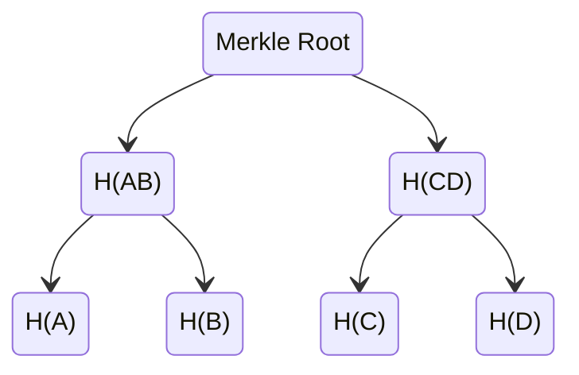
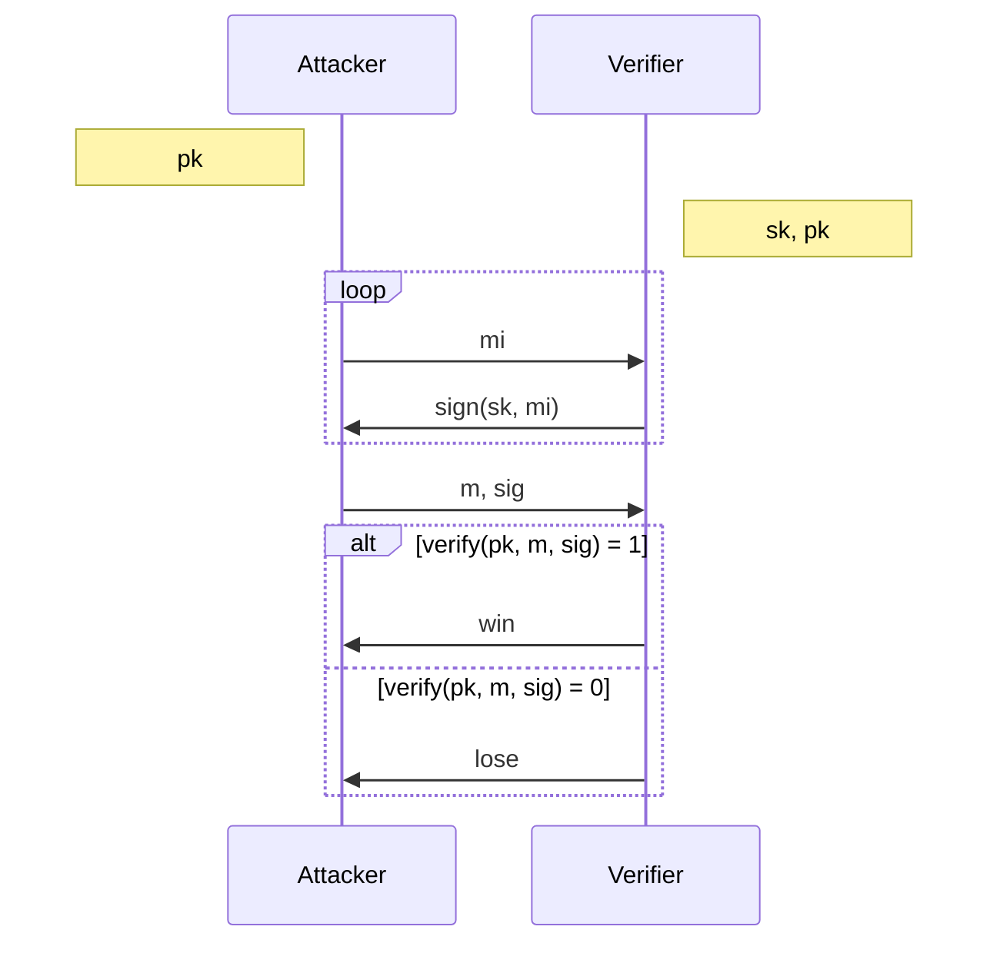

# Introduzione

## Funzioni hash crittografiche

Una funzione hash è definita come $H: \{0, 1\}^* \rightarrow \{0, 1\}^{256}$. Per essere una funzione hash crittografica deve possedere le seguenti proprietà:

- **collision free:** non è computazionalmente fattibile trovare due valori $x, y: x \ne y, H(x) = H(y)$
- **hiding:** con la sola conoscenza di $H(x)$, non è non è computazionalmente fattibile risalire ad $x$
  - **aggiunta di randomness:** se si sceglie una stringa $r$ con alta entropia minima[^1], posso costruire un valore $H(r|x)$ da quale non è possibile ricavare $x$
- **puzze friendly:** per ogni possibile output della funzione di hash, scelto un valore casuale $k$ da una distribuzione con alta entropia minima[^1], non è computazionalmente fattibile trovare un valore di $x$ tale che $H(k|x) = y$

### Applicazione: Commitment

Dupla composta da due algoritmi: $\mathcal{Comm} = (\mathcal{Commit}, \mathcal{Verify})$, con $\mathcal{Commit}: M \times R \rightarrow C$, e $\mathcal{Verify}: C \times M \times R \rightarrow \{0, 1\}$.

Bisogna assicurarsi che siano verificate sia la proprietà di **hiding** che di **binding**. Con **binding** si intende che non deve essere possibile per chi ha prodotto l'hash sulla coppia $(m, r)$ superare la funzione di verifica con una coppia $(m', r')$, dove $m \ne m'$

- è hiding perché non è possibile testare direttamente la funzione hash su un valore, poiché senza conoscere la randomness non è possibile calcolare il valore hash corretto
- è binding, poiché se $m \ne m'$, ne segue che $r|m \ne r'|m'$. Se i due hash coincidono, l'avversario avrebbe trovato una collisione. Nell'ipotesi che la funzione $H$ scelta sia collision resistant, ciò non è possibile

### Applicazione: Search Puzzle

Fissato un "puzzle ID" $id$ fa una distribuzione con alta entropia minima[^1] e un set obiettivo $Y$, si provi a trovare un valore soluzione $x$ tale che $H(id|x) \in Y$. La proprietà **puzzle friendly** ci assicura che non ci sia una strategia migliore che provare valori casuali di $x$.

### Hash pointer

Un hash pointer è un puntatore a una locazione dove l'informazione è immagazzinata, nonché l'hash crittografico di suddetta informazione. Ciò ci da, in un colpo solo, sia un modo per ritrovare il dato che per verificare che questo non sia stato modificato.

### Strutture dati con Hash  pointers

In generale è possibile usare gli hash pointers in qualsiasi struttura **priva di cicli**.

#### Linked list

Una linked list che utilizza gli hash pointers per puntare al nodo precedente è la forma più semplice di blockchain. Ciò che questa struttura garantisce è che, se avviene una modifica in uno qualsiasi dei nodi, ciò è subito individuato con un controllo sui nodi successivi, in quanto l'hash pointer risulterà scorretto.

#### Merkle tree

I **Merkle tree** sono alberi binari che utilizzano gli hash pointers per indicare i figli destro o sinistro. Poiché è necessario memorizzare solo la radice dell'albero, forniscono un modo estremamente compatto per assicurare che tutti i dati presenti siano rimasti inalterati. Inoltre, per assicurarsi che uno specifico valore **appartenga** effettivamente all'albero, p sufficiente fare $O(\log n)$ e fornire unicamente gli hash che servono per ricostruire la Merkle root a partire dal valore che stiamo verificando.

Se il Merkle tree è ordinato, inoltre, lo si può usare per verificare la **non** appartenenza di un elemento in tempo $O(\log n)$, mostrando i valori dei nodi immediatamente antecedente e successivo a quello che dovrebbe contenere il valore non presente.

## Firme digitali

Le firme digitali sono primitive crittografiche con le seguenti proprietà:

- solo chi possiede la chiave segreta associata alla firma è in grado di forgiarla
- chiunque può verificare che la firma sia autentica
- la firma è associata ad un particolare documento (o dato)

### Caratteristiche

Una firma digitale ha bisogno della tripla $\mathcal{DS} = (\mathcal{KeyGen}, \mathcal{Sign}, \mathcal{Verify})$. 
La prima funzione produce una coppia di chiavi, la prima, segreta, usata per generare la firma e la seconda, pubblica, per verificarne la validità.
La seconda funzione prende in input una chiave segreta e un messaggio e genera la firma corrispondente.
La terza prende in input una firma, un messaggio ed una chiave pubblica e dà il responso sulla validità della firma.

Perché tutto questo funzioni, è necessario che una firma valida è sempre riconosciuta come tale e che un avversario che conosca solo la chiave pubblica non sia in grado di forgiare una firma che passi la validazione.

Ci sono alcune limitazioni che spesso sono aggirate o ignorate nella pratica:

- gli algoritmi, specie quello di generazione della chiave, potrebbe aver bisogno di una buona fonte di randomness
- c'è un limite sulla dimensione del messaggio che si può firmare
  - possiamo però firmare l'hash del messaggio

### EC-DSA

Piuttosto che utilizzare uno schema di firma tradizionale, la maggior parte delle criptovalute ha optato per utilizzare un schema di firma basato sulle curve ellittiche. Nello specifico, la curva utilizzata è **Secp256k1**. Questa è definita come $y^2 = x^3 + 7$. Il vantaggio di usare questo tipo di schemi è che generalmente si riesce a raggiungere un livello di sicurezza adeguato utilizzando parametri più corti.

| Parametro                  | Dimensione |
| -------------------------- | ---------- |
| Private Key                | 256 bit    |
| Public key (non compressa) | 512 bit    |
| Public key (compressa)     | 257 bit    |
| Messaggio da firmare       | 256 bit    |
| Firma                      | 512 bit    |

Si noti che, sebbene le dimensioni del messaggio che ECDSA è in grado di firmare siano decisamente limitate, questo non rappresenta un problema nel momento in cui il messaggio può essere hashato prima di essere firmato.

Scendendo ora nei dettagli dell'algoritmo di firma, una firma digitale $s$ su un messaggio $m$ viene prodotta nella seguente maniera:
$$
\text{Parametri pubblici: } \text{curva Secp256k1}, G, n \\
\text{Parametri segreti: } x \\
\\
\begin{array}{lll}
M &=& H(m) \\
k &\xleftarrow{$}& \{1, 2, ..., n - 1\} \\
(x, y) &=& k \times G \\
r &=& x \mod n & (r \ne 0)\\ 
s &=& k^{-1}(M + rx) \mod n & (s \ne 0)
\end{array} \\
\\
\text{Output: } (r, s)
$$
L'algoritmo di verifica di una firma $(r, s)$ su un messaggio $m$ procede così:
$$
\text{Parametri pubblici: } \text{curva Secp256k1}, G, n, pk \\
\\
\begin{array}{lll}
r, s &\in& [1, n-1] \\
M &=& H(m) \\
u_1 &=& Ms^{-1} \mod n \\
u_2 &=& rs^{-1} \mod n \\
(x, y) &=& u_1 \times G + u_2 \times pk = \\ 
&=& (M + rx)s^{-1} \times G = \\
&=& \frac{M + rx}{M +rx} k \times G = \\
&=& k \times G
\end{array} \\
\\
\text{Output: } \begin{cases} 1 & \text{se } r \equiv x \mod n \\ 0 & \text{altrimenti} \end{cases}
$$

### Public key come identità

In un sistema che si basa sulla firma digitale, l'idea di identità si sposa perfettamente con la chiave pubblica di quella entità. In altre parole, vedendo un messaggio *msg* che verifica $\mathcal{verify}(pk, msg, sig) == 1$, si può pensare che questo messaggio sia stati inviato da "*pk*". Creare una nuova identità consiste semplicemente nel generare una nuova coppia di chiavi. Sebbene non ci sia quindi nessun legame fra chiave e utilizzatore, uno studio attento di pattern potrebbe comunque tradire l'identità dell'utente. Questo sistema non garantisce quindi anonimato, ma pseudo-anonimato.

[^1]: Alta entropia minima vuol dire che la distribuzione è sufficientemente vicina alla distribuzione uniforme