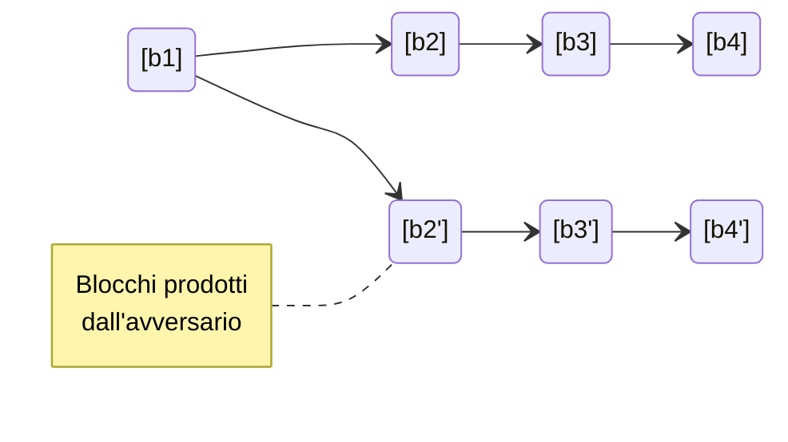
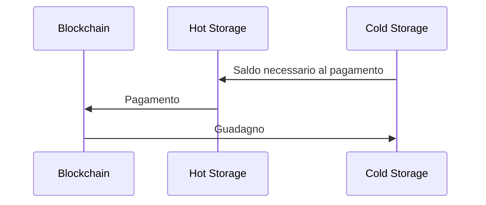
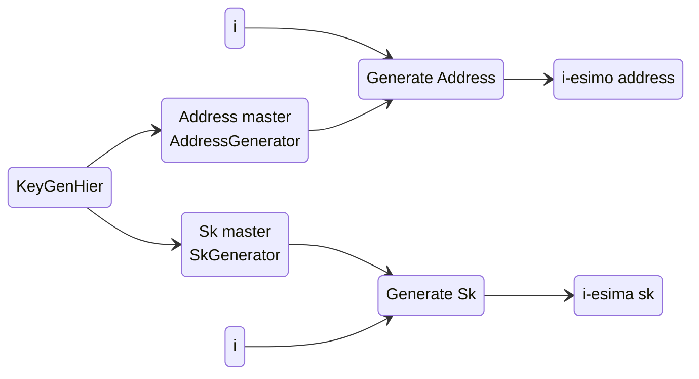

# Blockchain

La blockchain sembra essere una soluzione promettente per risolvere il problema della centralizzazione e permettere un sistema che sia davvero distribuito. Ma ci sono diverse challenge da affrontare.

## Consenso

Il protocollo di consenso che verifica la validità delle transazioni, e quindi dei blocchi, deve essere condiviso e accettato da tutti i nodi della blockchain. Ci sono diversi ostacoli da superare:

- un nodo potrebbe essere temporaneamente non disponibile
- un nodo potrebbe essere malevolo
- non c'è un concetto globale di tempo
- la rete non è sempre affidabile

Ci sono molti teoremi che parlano di come questo prolema sia delicato, come il *Byzantine generals problem*, che afferma che tutto va a rotoli se più di un terzo di nodi sono malevoli e il *Fischer-Lynch-Paterson*, che afferma che il consenso è impossibile con anche un solo nodo malevolo.

Nonostante questi risultati poco promettenti, nella pratica il protocollo sembra funzionare, e tuttora non si sono verificati attacchi che ne minino la fiducia.

### Consenso di Nakamoto

Un approccio che si ha avuto successo nella pratica è stato proposto da Satoshi Nakamoto. Si tratta del protocollo dietro Bitcoin, ed è chiamato **Proof of Work**.
L'idea è che i miner competano per trovare una nonce da inserire nel **block header** tale che $H(block) \lt Target$. Inoltre, in presenza di più catene potenzialmente corrette, viene considerata valida solo quella più lunga. 

#### Proprietà

1. **Consistenza:** tutti gli agenti onesti accettano tutti i blocchi già presenti ad eccezione degli ultimi **k**, con possibilità di errore $O(2^{-k})$
2. **Chain quality:** ogni sequenza di **k** blocchi deve contenere un numero sufficiente di blocchi prodotti agenti onesti
3. **Chain growth:** la blockchain deve crescere con costanza

#### Fork causata da un avversario

Sia **A** un avversario che possieda una potenza di hash $q \lt \frac{1}{2}$. A partire da un tempo **t**, l'avversario è in grado di produrre una catena più lunga di quella a cui stanno lavorando tutti i nodi onesti?

Per riuscire a avere successo, **A** deve portarsi in vantaggio di un certo numero di blocchi **z**.
$$
\begin{cases}
+1 & \text{A produce un blocco} \\
-1 & \text{I nodi onesti producono un blocco}
\end{cases}
$$
La probabilità che **A** ci riesca al variare di **z** è
$$
P_z = \begin{cases}
(\frac{q}{p})^z & \text{se } p \gt q \\
1 & \text{altrimenti}
\end{cases}
$$
Sebbene apparentemente l'unico fattore determinante sia la potenza di calcolo **p** di **A**, nella realtà le cose sono più complicate. La blockchain è un sistema distribuito asincrono, e ogni comunicazione soffre di un ritardo dovuto alla rete, aspetto che un avversario ben organizzato potrebbe sfruttare a proprio vantaggio.

Si supponga che sugli **n** nodi che compongono la blockchain, una frazione $\alpha$ siano onesti e che la probabilità che ognuno di essi produca un nuovo blocco sia **h**. La probabilità che un blocco venga prodotto onestamente in un determinato round è $1 - (1-h )^{\alpha n} \approx \alpha h n$. Reciprocamente, un blocco onesto viene prodotto ogni $\frac{1}{ahn}$ round. C'è da aggiungere anche il ritardo della rete $\Delta$, che fa sprecare ulteriori round.
Quindi in realtà la frequenza di produzione di blocchi onesti è più bassa, più vicina a $1- \alpha hn\Delta$. L'avversario ha bisogno di superare questa capacità ridotta per rappresentare una seria minaccia alla stabilità del sistema. 

Ecco che quindi la scelta di una difficoltà variabile per il puzzle, che poteva sembrare arbitraria, diventa necessaria per rallentare la creazione dei blocchi ed assicurarsi che il ritardo imposto dalla rete diventi trascurabile rispetto al tempo di creazione di un nuovo blocco, minimizzando questo tipo di vantaggio concesso all'avversario.

Più formalmente, si dimostra che il consenso di Nakamoto è sicuro se:

- $2hn\Delta \lt \frac{1}{2}$
- $\alpha(1-2hn\Delta) \gt \beta$, con $\beta$ la percentuale di nodi malevoli

#### Analisi delle probabilità

$$
P_z = P_1^z \\
A: \text{avversario recupera di una posizione}\\
F: \text{avversario produce un blocco}\\
P_1 = Pr[A] = Pr[A \and F] + Pr[A \and \neg F] = \\
= Pr[A|F]Pr[F] + Pr[A|\neg F]Pr[\neg F] = \\
= q + pP_2 = q + pP_1^2
$$

## Nodi malevoli

### Rubare

Non è possibile creare e firmare transazioni a nome di un altro utente sotto l'ipotesi che la cittografia sia sicura

### Denial of service

Per quanto un nodo si possa precludere il diritto di evitare di inserire transazioni di un determinato utente nei blocchi che produce, finchè ci sarà un sufficiente numero di nodi onesti prima o poi la transazione farà parte della blockchain.

### Double spending

Il nodo malevolo effettua una transazione verso un altro utente, da cui riceve il bene. Potrebbe poi produrre il blocco in cui quella transazione andrebbe registrata, ma eliminandola, di fatto cancellandola dalla blockchain. 
Per evitare questo tipo di attacco, le blockchain applicano il principio di continuare la catena più lunga. Quindi, se il nodo malevolo è l'unico a tentare questo attacco, dovrebbe essere in grado di proseguire la sua catena "alternativa" da solo, contro l'intera rete, che proseguirà la catena più lunga. La garanzia che ciò non sia fattibile per un attaccante è probabilistica e dipende dall'algorimo di consenso

### Selfish mining

Dopo aver trovato il prossimo blocco valido, un miner potrebbe non annunciare subito la sua scoperta e invece mantenerlo per sé, così da avere un vantaggio nella ricerca del prossimo blocco che estenda la catena a partire dall'ultimo che ha trovato. Sebbene questo sembrerebbe un tipo di attacco sia assolutamente fattibile anche con una potenza di hash tutto sommato limitata, sembra che ancora una volta la pratica smentisca la teoria, in quanto non è stato ancora osservato.

## Indirizzi

Una volta prodotta una coppia di chiavi pubblica e privata, la seconda viene usata per generare un indirizzo pubblico che identificherà l'utente e permetterà di ricevere pagamenti da altri utenti. L'indirizzo viene generato applicando una funzione hash alla chiave pubblica (nel caso di Bitcoin vengono applicate in sequenza `sha256` e `kasha160`) e il risultato ottenuto viene codificato in base-58, che esclude caratteri problematici come 0 e O, e viene aggiunta un numero di versione e un piccolo checksum che previene errori di battitura.
Esistono anche i vanity address che sono indirizzi che contengono parole di senso compiuto. Per ottenerli, vengono generati un gran numero di coppie di chiavi, sperando che una delle chiavi pubbliche generi l'indirizzo desiderato.

## Wallet criptovalute

### La triade ideale

- **disponibilità:** essere in grado di spendere le proprie criptovalute
- **sicurezza:** minimizzare il rischio di rendere note informazioni sensibili
- **comodità:** è semplice utilizzare il proprio wallet

Un tipo di wallet che ha riscosso particolare successo sono i **software wallet**, che riescono a raggiungere un buon livello di sicurezza, mantenendo una elevata comodità, dato che il software gestisce indirizzi e chiavi in maniera trasparente all'utente.

### Hot Storage e Cold Storage

Al fine di proteggere la chiave segreta, un primo approccio potrebbe memorizzare in due punti separati due coppie di chiavi diverse: la prima, l'hot storage, richiede minore sicurezza, e viene utilizzato per effettuare i pagamenti. Quindi l'indirizzo associato alla questa chiave segreta non ha mai un saldo troppo alto.
Al contrario, il cold storage sfrutta meccanismi di sicurezza più elevati, e usa il proprio indirizzo pubblico per riceve pagamenti e mantenere il saldo dell'utente, senza però effettuare pagamenti, se non verso l'hot storage.

### Hierarchical Wallet

L'idea è quella di generare una coppia composta da una chiave segreta master e un indirizzo master che sono a loro volta in grado di  generare ulteriori chiavi segrete e indirizzi, con la caratteristica che l'i-esima coppia possiede la relazione standard chiave segreta-indirizzo.

