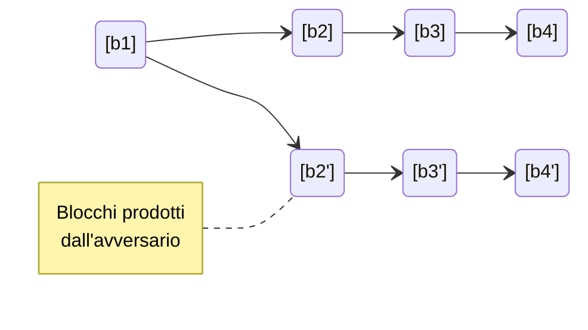
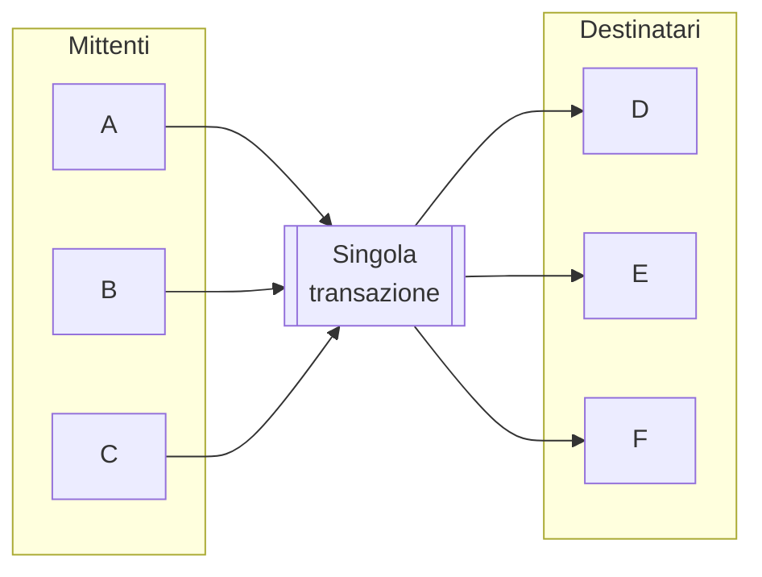
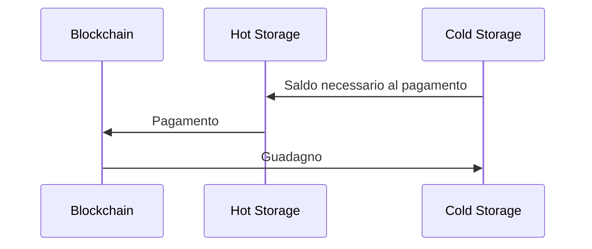
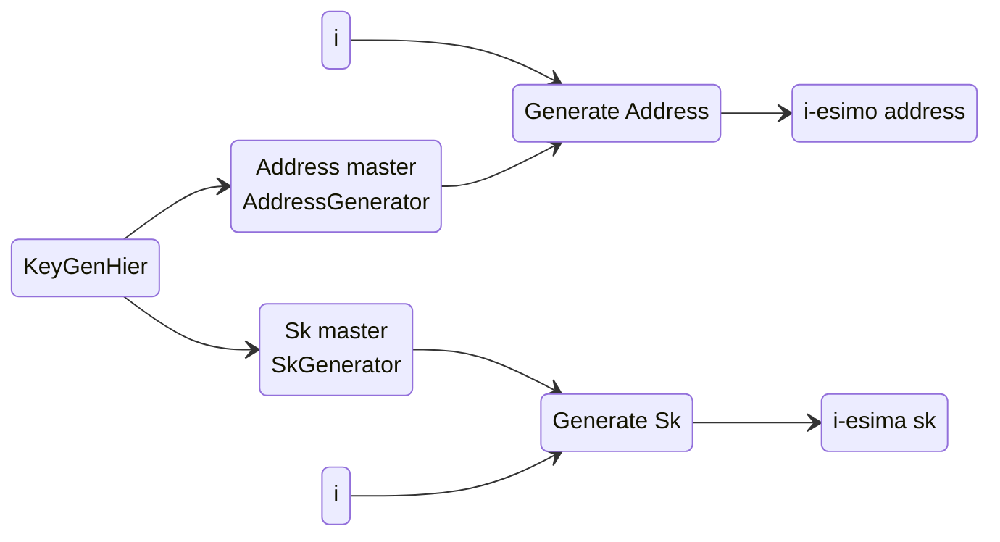

# Blockchain

La blockchain sembra essere una soluzione promettente per risolvere il problema della centralizzazione e permettere un sistema che sia davvero distribuito. Ma ci sono diverse challenge da affrontare.

## Consenso

Il protocollo di consenso che verifica la validità delle transazioni, e quindi dei blocchi, deve essere condiviso e accettato da tutti i nodi della blockchain. Ci sono diversi ostacoli da superare:

- un nodo potrebbe essere temporaneamente non disponibile
- un nodo potrebbe essere malevolo
- non c'è un concetto globale di tempo
- la rete non è sempre affidabile

Ci sono molti teoremi che parlano di come questo prolema sia delicato, come il *Byzantine generals problem*, che afferma che tutto va a rotoli se più di un terzo di nodi sono malevoli e il *Fischer-Lynch-Paterson*, che afferma che il consenso è impossibile con anche un solo nodo malevolo.

Nonostante questi risultati poco promettenti, nella pratica il protocollo sembra funzionare, e tuttora non si sono verificati attacchi che ne minino la fiducia.

### Consenso di Nakamoto

Un approccio che si ha avuto successo nella pratica è stato proposto da Satoshi Nakamoto. Si tratta del protocollo dietro Bitcoin, ed è chiamato **Proof of Work**.
L'idea è che i miner competano per trovare una nonce da inserire nel **block header** tale che $H(block) \lt Target$. Inoltre, in presenza di più catene potenzialmente corrette, viene considerata valida solo quella più lunga. 

#### Proprietà

1. **Consistenza:** tutti gli agenti onesti accettano tutti i blocchi già presenti ad eccezione degli ultimi **k**, con possibilità di errore $O(2^{-k})$
2. **Chain quality:** ogni sequenza di **k** blocchi deve contenere un numero sufficiente di blocchi prodotti agenti onesti
3. **Chain growth:** la blockchain deve crescere con costanza

#### Fork causata da un avversario

Sia **A** un avversario che possieda una potenza di hash $q \lt \frac{1}{2}$. A partire da un tempo **t**, l'avversario è in grado di produrre una catena più lunga di quella a cui stanno lavorando tutti i nodi onesti?

Per riuscire a avere successo, **A** deve portarsi in vantaggio di un certo numero di blocchi **z**.
$$
\begin{cases}
+1 & \text{A produce un blocco} \\
-1 & \text{I nodi onesti producono un blocco}
\end{cases}
$$
La probabilità che **A** ci riesca al variare di **z** è
$$
P_z = \begin{cases}
(\frac{q}{p})^z & \text{se } p \gt q \\
1 & \text{altrimenti}
\end{cases}
$$
Sebbene apparentemente l'unico fattore determinante sia la potenza di calcolo **p** di **A**, nella realtà le cose sono più complicate. La blockchain è un sistema distribuito asincrono, e ogni comunicazione soffre di un ritardo dovuto alla rete, aspetto che un avversario ben organizzato potrebbe sfruttare a proprio vantaggio.

Si supponga che sugli **n** nodi che compongono la blockchain, una frazione $\alpha$ siano onesti e che la probabilità che ognuno di essi produca un nuovo blocco sia **h**. La probabilità che un blocco venga prodotto onestamente in un determinato round è $1 - (1-h )^{\alpha n} \approx \alpha h n$. Reciprocamente, un blocco onesto viene prodotto ogni $\frac{1}{ahn}$ round. C'è da aggiungere anche il ritardo della rete $\Delta$, che fa sprecare ulteriori round.
Quindi in realtà la frequenza di produzione di blocchi onesti è più bassa, più vicina a $1- \alpha hn\Delta$. L'avversario ha bisogno di superare questa capacità ridotta per rappresentare una seria minaccia alla stabilità del sistema. 

Ecco che quindi la scelta di una difficoltà variabile per il puzzle, che poteva sembrare arbitraria, diventa necessaria per rallentare la creazione dei blocchi ed assicurarsi che il ritardo imposto dalla rete diventi trascurabile rispetto al tempo di creazione di un nuovo blocco, minimizzando questo tipo di vantaggio concesso all'avversario.

Più formalmente, si dimostra che il consenso di Nakamoto è sicuro se:

- $2hn\Delta \lt \frac{1}{2}$
- $\alpha(1-2hn\Delta) \gt \beta$, con $\beta$ la percentuale di nodi malevoli

#### Analisi delle probabilità

$$
P_z = P_1^z \\
A: \text{avversario recupera di una posizione}\\
F: \text{avversario produce un blocco}\\
P_1 = Pr[A] = Pr[A \and F] + Pr[A \and \neg F] = \\
= Pr[A|F]Pr[F] + Pr[A|\neg F]Pr[\neg F] = \\
= q + pP_2 = q + pP_1^2
$$

Le blockchain attuali si basano su una prova che garantisca che i miner che guadagna una ricompensa abbia effettivamente svolto il lavoro previsto.

## Algoritmi di consenso basati su puzzle

### Bad puzzle (sequenziale)

Un cattivo puzzle è un puzzle in cui il più forte vince sempre. 
Ad esempio, se il puzzle fosse risolvere una computazione sequenziale di $n$ passi, il computer con maggiore potenza computazionale ha la certezza di vincere, a discapito degli altri partecipanti.

### Good puzzle (weighted)

Al contrario, un buon puzzle dovrebbe dare un output che sia casuale ma pesato, in modo da avvantaggiare i partecipanti in proporzione alle risorse messe a disposizione da questi.

### ASIC Resistant Puzzles

Una grande ambizione che si vorrebbe poter applicare è quella di evitare la nascita di strumenti estremamente specializzati per poter fare mining.
Questi dispositivi hanno potenze di calcolo inarrivabili, e permettono a grandi aziende manufatturiere di guadagnare in maniera spropositata, a discapito dei piccoli player. Rimuovere questo tipo di necessità permetterebbe a dispositivi molto più semplici, come pc e addirittura smarphone, la possibilità di partecipare. 

### Hash function basata sulla memoria

Una funzione memory hard è una funzione che ha costo lineare se si è in grado di utilizzare una quantità sufficiente di memoria, ma che diventa quadratico se invece non la si vuole (o non si può) utilizzare. Questo è l'approccio usato da Litecoin.

Un esempio di implementazione è il seguente (colin percivalI):

-  si riempie la memoria con valori random (write stage)
-  si legge la memoria in un ordine casuale (read stage)

$$
\textbf{Passo 1: } \\
\text{Input: } x \\
\begin{array}{l}
V_1 &= H(x) \\
V_2 &= H(V_1) &= H(H(x)) \\
V_3 &= H(V_2) &= H^3(x) \\
... \\
V_n &= H^n(x) \\
\end{array} \\
\\
\textbf{Passo 2: } \\
\begin{array}{l}
A &\leftarrow H^{n+1}(x) = H(V_n) \\
\text{For } &k = 1 \text{ to } n: \\
&i \leftarrow A \mod n \\
&A \leftarrow H(A \oplus V_i)
\end{array}
$$

In base alla quantità di storage utilizzata per mantenere i risultati della funzione memorizzati senza doverli ricalcolare, posso ottenere una complessità variabile. Posso, in altre parole, stabilire un tradeoff fra complessità e memoria.

### Proof of work utili

Un idea per giustificare l'enorme spreco che la proof of work richiede è quella di usare quelle risorse per qualcosa di utile. A questo scopo nasce ad esempio Primecoin, che propone un puzzle che consiste nel trovare catene il più lunghe possibili di primi con specifiche caratteristiche.

**Cunningham chain:** $p_1, p_2, ..., p_n$ con $p_i = 2p_{i-1} + 1$.

### Proof of stake

La proof of work ha uno step non necessario, lo spreco enorme di risorse. Una possibile soluzione a questo problema è la proof of stake.
La blockchain più famosa che adotta questo sistema è Algorand.

Però, se non vi è uno spreco di risorse, cosa da valore alla moneta?

## Nodi malevoli

### Rubare

Non è possibile creare e firmare transazioni a nome di un altro utente sotto l'ipotesi che la cittografia sia sicura

### Denial of service

Per quanto un nodo si possa precludere il diritto di evitare di inserire transazioni di un determinato utente nei blocchi che produce, finchè ci sarà un sufficiente numero di nodi onesti prima o poi la transazione farà parte della blockchain.

### Double spending

Il nodo malevolo effettua una transazione verso un altro utente, da cui riceve il bene. Potrebbe poi produrre il blocco in cui quella transazione andrebbe registrata, ma eliminandola, di fatto cancellandola dalla blockchain. 
Per evitare questo tipo di attacco, le blockchain applicano il principio di continuare la catena più lunga. Quindi, se il nodo malevolo è l'unico a tentare questo attacco, dovrebbe essere in grado di proseguire la sua catena "alternativa" da solo, contro l'intera rete, che proseguirà la catena più lunga. La garanzia che ciò non sia fattibile per un attaccante è probabilistica e dipende dall'algorimo di consenso

### Selfish mining

Dopo aver trovato il prossimo blocco valido, un miner potrebbe non annunciare subito la sua scoperta e invece mantenerlo per sé, così da avere un vantaggio nella ricerca del prossimo blocco che estenda la catena a partire dall'ultimo che ha trovato. Sebbene questo sembrerebbe un tipo di attacco sia assolutamente fattibile anche con una potenza di hash tutto sommato limitata, sembra che ancora una volta la pratica smentisca la teoria, in quanto non è stato ancora osservato.

## Indirizzi

Una volta prodotta una coppia di chiavi pubblica e privata, la seconda viene usata per generare un indirizzo pubblico che identificherà l'utente e permetterà di ricevere pagamenti da altri utenti. L'indirizzo viene generato applicando una funzione hash alla chiave pubblica (nel caso di Bitcoin vengono applicate in sequenza `sha256` e `kasha160`) e il risultato ottenuto viene codificato in base-58, che esclude caratteri problematici come 0 e O, e viene aggiunta un numero di versione e un piccolo checksum che previene errori di battitura.
Esistono anche i vanity address che sono indirizzi che contengono parole di senso compiuto. Per ottenerli, vengono generati un gran numero di coppie di chiavi, sperando che una delle chiavi pubbliche generi l'indirizzo desiderato.

## Anonimato

Vi sono vari approcci all'anonimato.

- Poter interagire senza utilizzare il **proprio nome**
- Poter interagire senza usare **alcun nome**

Perché si ottenga una condizione di anonimità in computer science, si presuppone di avere un sistema che garantisca **pseudoanonimato** (non si utilizza un nome vero) e **unlikability** (non è possibile tracciare lo stesso utente lungo più interazioni). Questo non è un problema per nulla banale. Anche una semplice osservazione empirica, come il fatto che il primo nodo ad informati di una transazione è probabilmente anche quello che l'ha generata, può minare seriamente questa proprietà.

### TOR (The Onion Router)

Tor è un software che permette di navigare online con un certo livello di anonimato pensato per applicazioni che necessitano di una bassa latenza, come la navigazione online.

Il funzionamento è il seguente: determinata una selezione di nodi all'interno della rete TOR, il messaggio da inviare viene cifrato con chiavi simmetriche dei nodi, nell'ordine in cui voglio che i nodi vengano attraversati. In questo modo, dopo aver cifrato il messaggio originale n volte, gli n nodi che il messaggio attraverserà toglieranno ciascuno il livello di cifratura che gli compete, così che il plaintext sia ottenuto solo al raggiungimento del destinatario.

### Mix Network

Ogni transazione passa da una serie di intermediari che si occupano di riordinare le richieste, disaccoppiando input ed output. 
Molti light Wallet già applicano questo tipo di operazioni, ma si tratta di un comportamento non garantito, che potrebbe cambiare in futuro, senza contare che c'è la possibilità che venga tenuta traccia della mix effettuato.
L'idea è quindi quella di utilizzare un sistema dedicato. Questo dovrebbe verificare le seguenti condizioni:

- Usare una serie di mixer con API standard, per garantire resistenza contro attori disonesti e attacchi
- Transazioni uniformi, in maniera che una transazione sia indistinguibile dalle altre. Meglio usare un gruppo ristretto di tagli standard
- I client dovrebbero essere automatizzati e comuni a quanto più simili possibile, così da non poterli usare per deanonimizzare l'utente sulla base delle caratteristiche del singolo client.
- Ci devono essere delle fee all-or-nothing

Attualmente non sembra esserci uno standard ufficiale per i mixing server su Bitcoin.

Un approccio promettente è quello di utilizzare un mixing decentralizzato, che quindi esclude una singola entità che svolge tutto il lavoro. Inoltre, per lo stesso principio di decentralizzazione, un attacco sarebbe reso molto più difficile dalla mole di agenti onesti presenti.
Ad esempio, si potrebbe ipotizzare che un gruppo di utenti si mette d'accordo e stila una lista di mittenti e destinatari, che riceveranno tutti una stessa somma. Tutti i futuri mittenti firmano la transazione, e nel momento in cui tutte le firme sono state apposte, la singola transazione è pubblicata. Ne segue che, pur conoscendo tutti gli agenti, è impossibile associare accuratamente la coppia mittente-destinatario.

Per poter effettuare questa operazione, sarebbe necessario trovare gli altri mittenti interessati a partecipare, scambiandosi gli indirizzi di input/output e costruire la transazione. Questo richiede che tutti firmino la transazione, in cui devono figurare tutti i destinatari.

Rimangono comunque una serie di problemi: come trovare altri partecipanti, è plausibile che i peers conoscano il mixing, e soprattutto chiunque potrebbe invalidare la transazione semplicemente non firmando la transazione.

## Wallet criptovalute

### La triade ideale

- **disponibilità:** essere in grado di spendere le proprie criptovalute
- **sicurezza:** minimizzare il rischio di rendere note informazioni sensibili
- **comodità:** è semplice utilizzare il proprio wallet

Un tipo di wallet che ha riscosso particolare successo sono i **software wallet**, che riescono a raggiungere un buon livello di sicurezza, mantenendo una elevata comodità, dato che il software gestisce indirizzi e chiavi in maniera trasparente all'utente.

### Hot Storage e Cold Storage

Al fine di proteggere la chiave segreta, un primo approccio potrebbe memorizzare in due punti separati due coppie di chiavi diverse: la prima, l'hot storage, richiede minore sicurezza, e viene utilizzato per effettuare i pagamenti. Quindi l'indirizzo associato alla questa chiave segreta non ha mai un saldo troppo alto.
Al contrario, il cold storage sfrutta meccanismi di sicurezza più elevati, e usa il proprio indirizzo pubblico per riceve pagamenti e mantenere il saldo dell'utente, senza però effettuare pagamenti, se non verso l'hot storage.

### Hierarchical Wallet

L'idea è quella di generare una coppia composta da una chiave segreta master e un indirizzo master che sono a loro volta in grado di  generare ulteriori chiavi segrete e indirizzi, con la caratteristica che l'i-esima coppia possiede la relazione standard chiave segreta-indirizzo.

Sia $pk = g^x, g, q$, ed $sk = x$. 
Si ricordi che nel caso di **ECDSA**, la firma digitale $s$ su un messaggio $m$ viene prodotta nella seguente maniera:
$$
\begin{array}{lll}
k &\xleftarrow{$}& \{1, 2, ..., q\} \\
R &=& g^k \mod q \\
M &=& H(m) \mod q \\
s &=& k^{-1}(M + Rx) \mod q
\end{array}
$$
Nel caso si parli di wallet gerarchici, alle chiavi pubblica e private viene aggiunta un piccola informazione addizionale. La procedura diventa la seguente:
$$
\begin{array}{lll}
\text{sk info} &= w, y \\
\text{i-th sk} &= x_i &= y + H(w|i) \\
\text{address info} &= w, g^y \\
\text{i-th address} &= g^{x_i} &= g^{H(w|i)}g^y
\end{array}
$$
Questo tipo di schema permette di generare in maniera indipendente un indirizzo e la chiave privata corrispondente. Basta infatti che l'indice coincida. Inoltre, anche se un avversario dovesse venire a conoscenza del valore di $w$, purchè la chiave segreta $y$ rimanga al sicuro,  non viene compromessa la sicurezza dello schema.
Questa strategia permette la creazione rapida e sicura di un gran numero di coppie chiave-indirizzo apparentemente indipendenti fra di loro, sebbene sarebbe possibile riconoscere che chiavi successive siano state prodotte dalla stessa matrice semplicemente facendone il rapporto, cosa che va a violare le proprietà di anonimato.

### Come memorizzare le informazioni segrete

Alcune soluzioni immediate per memorizzare informazioni segrete in maniera sicura includono

- **dispositivi offline**
- **brain wallet:** cifrare le informazioni segrete con una password memorizzabile sufficientemente lunga
- **paper wallet**
- **tamperproof devices:** dispositivi simili a smartcard in grado, all'occorrenza di produrre una firma digitale valida senza però divulgare la chiave segreta

### Dividere e distribuire le chiavi

Per migliorare ulteriormente la sicurezza delle informazioni sensibili è l'applicazione di tecniche **secret sharing**. L'idea è quella di suddividere le informazioni in **n** parti, ed assicurarsi che sia possibile ricostruire l'informazione se e solo se almeno **k** di queste parti sono riunite. 
SI può costruire un polinomio in $\Z_p$, del tipo $f(x) = s + a_1 x + a_2 x^2 + ... + x_k x^k$ in maniera tale che è necessario che **k** dei detentori dei punti noti si mettano d'accordo per riuscire a ricostruire il valore di $s$. Il punto debole di questo approccio è che, una volta ricostruito, nulla protegge più il segreto da potenziali agenti malevoli.

### Threshold Cryptography

L'approccio della crittografia a soglia è un modo per ottenere un risultato simile a quanto detto sopra, ma senza la necessità di ricostruire il segreto originale. 
$$
\begin{array}{lll}
\text{Player }i \\
f(i) &=& z_i \\
r_i &\xleftarrow{$}& \{1, 2, ..., q\} \\
\text{Output - } R_i &=& g^{r_i} \mod q \\
R &=& \prod R_i &=& g^{\sum r_i} \\
e &=& H(m, R) \\
\text{Output - } Z_i &=& r_i + e \lambda_iz_i \mod q  \\
\sum_i Z_i &=& \sum_i (r_i + e \lambda_i z_i) &=& \sum_i r_i + e \sum_i\lambda_i z_i
\end{array}
$$

## Servizi economici

### Exchange

I servizi di excange permettono di scambiare valuta fiat (euro, dollari) in una criptovaluta a propria scelta. Poiché l'unico modo per generare criptovalute previsto dal protocollo è quello di diventare un miner, questi tipi di servizi permettono in maniera estremamente semplice e immediata di ottenere la somma desiderata di criptovaluta. È bene notare, però, che si tratta di agenti esterni, non previsti dai protocolli della blockchain, e che sono quindi soggetti a qualsivoglia truffa, come lo schema Ponzi, senza contare rischi di hacking e ingegneria sociale. 
Ciò che rende particolarmente insidioso il tutto è che, in assenza di alcun tipo di garante o regolamentazione, il piccolo investitore si assume tutto il rischio, senza appello.

### Proof of reserve e Proof of liabilities

Al fine di guadagnarsi la fiducia degli investitori, gli istituti di exchange possono sottoporsi ad proof of reserve di varie tipologie.

- **Proof of reserve:** effettuando una transazione a se stessi (o ad un indirizzo che si possiede), aggiungendo una string di challenge alla transazione, l'entità è in grado di di dimostrare di possedere almeno quella quantità di liquidità
- **Proof of liabilities:** si costruisce un **Merkle tree** a partire dal saldo di tutti gli utenti, e si pubblica unicamente la Merkle root. Ogni utente può verificare lo stato del proprio account richiedendo una verifica di inclusione nel Merkle tree all'entità

