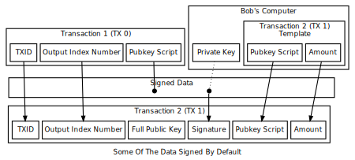
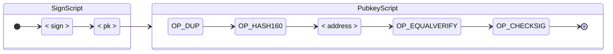

# Bitcoin

## Blockchain

La blockchain è una struttura dati ordinata, immutabile e condivisa che mantiene una traccia di tutte le transazioni effettuate. Questa soluzione, se ben implementata, evita pratiche quali double spending e la modifica di transazioni precedenti.

Ogni full-node Bitcoin possiede una copia personale dell'intera blockchain, validata blocco per blocco. Se più nodi possiedono una copia conforme della stessa blockchain, essi sono in **consenso**. Perché ciò avvenga, devono essere stabilite delle regole comuni, definite **regole di consenso**.

## Blocchi

La blockchain è composta da blocchi a cui sono associate un gruppo di transazioni. In realtà, queste vanno poi a comporre un **Merkle tree**, e solo la **Merkle root** viene salvata nel **block header**, al fine di ridurre al minimo lo spazio utilizzato senza compromettere la sicurezza della struttura. Nel **block header** viene salvato anche l'hash del blocco precedente,  per assicurare che una qualsiasi parte della catena non possa essere modificata senza che ciò invalidi tutti i blocchi successivi.


### Transazioni in un blocco

Ogni blocco, per essere creato, deve comprendere almeno la **coinbase transaction**. Questa transazione speciale assegna la ricompensa prevista in quel momento al miner, con la condizione straordinaria che l'**UTXO** non potrà essere speso se non fra 100 blocchi, per dare il tempo alla chain di assicurarsi che il blocco sia definitivo.

Sebbene sia sufficiente includere solo questa singola transazione, è nell'interesse dei miner provare a saturare il blocco con altre transazioni, in quanto queste potrebbero includere delle fee addizionali che il miner potrebbe intascarsi, rendendole ancora più appetibili ai suoi occhi.

Tutte le transazioni sono salvate in formato binario, e il valore ottenuto viene poi hashato per ottenere il **TxID**. Tutti i TxIDs, accoppiati a due a due, vengono usati per costruire il **Merkle tree**. Un eventuale TxID dispari viene accoppiato con una copia di se stesso. Il processo si conclude con il calcolo della **Merkle root**. L'utilizzo di un Merkle tree rende anche molto efficiente verificare la presenza di una determinata transazione nel blocco senza doverle scaricare tutte. Ad esempio, per verificare che D è stato aggiunto nel blocco, un nodo light necessita solo delle TxID *C*, *AB*, and *EEEE*, oltre che alla Merkle root, presente nel block header.

```
       ABCDEEEE .......Merkle root
      /        \
   ABCD        EEEE
  /    \      /
 AB    CD    EE .......E is paired with itself
/  \  /  \  /
A  B  C  D  E .........Transactions
```

### Hard e soft forks

Nel momento in cui viene cambiato l'algoritmo di consenso, qualsiasi sia il motivo, si viene a creare una situazione particolare, in cui si possono avere risvolti diversi a seconda del tipo di cambiamento.

- **Hard fork:** un blocco prodotto con il nuovo protollo viene accettato dai nodi aggiornati ma rigettato da quelli vecchi. Si crea una incompatibilità irrisolvibile e si sdoppia la blockchain
- **Soft fork:** un blocco che prodotto con il nuovo protocollo è comunque un blocco valido agli occhi dei nodi vecchi, e viene quindi accettato da tutti. Al contrario, un blocco che segue il vecchio protocollo verrà rigettato dai nodi nuovi. Se i nodi aggiornati sono la maggioranza, la catena proseguirà con il protocollo aggiornato

Per evitare disservizi e mantenere tutti i nodi aggiornati, cambiamenti significativi di questo tipo sono programmati con largo anticipo inserendo una flag all'interno del software che verrà attivata all'unisono al momento stabilito. Si tratta delle **[User Activated Soft Forks](https://developer.bitcoin.org/glossary.html#term-UASF) (UASF).** Un'altra metodologia è attendere che la maggior parte dei miner si dica pronta al passaggio. Ciò dà vita alle **[Miner Activated Soft Forks](https://developer.bitcoin.org/glossary.html#term-MASF) (MASF)**.

### Accorgersi delle fork

Poiché le fork possono essere estremamente dannose per gli utenti Bitcoin, con potenziali perdite economiche, i software hanno dei sistemi per accorgersi se una fork è in atto, allertando il proprietario. Ciò avviene, ad esempio, se un nodo riceve diversi blocchi più aggiornati del proprio che però non riesce a validare, oppure se la transaction number ricevuta inizia a divergere parecchio da quella usata. Un light node può anche rendersi conto del problema interpellando molti full node che iniziano a fornire altezze dei blocchi molto diverse, segno che sono in disaccordo sull'algoritmo di consenso.

## Transazioni

Sebbene si possa avere l'impressione di possedere un account con un bilancio ben stabilito e facilmente consultabile, la verità è che i bitcoin si muovono transazione per transazione. In effetti, ogni bitcoin speso, che diventa l'**output** della transazione, diverrà poi l'**input** di una transazione successiva. Una transazione può creare multipli output, ma uno specifico output può essere usato come input una sola volta in tutta la blockchain. Provare ad utilizzarlo successivamente sarebbe un tentativo di double spending.

Gli output sono identificati da i **[transaction identifiers](https://developer.bitcoin.org/glossary.html#term-Txid) (TxIDs)**. Si tratta degli hash delle transazioni firmate. Gli output delle transazioni in un determinato istante di vita della blockchain posso essere suddivisi in **[Unspent Transaction Outputs (UTXOs)](https://developer.bitcoin.org/glossary.html#term-UTXO)** o **Spent Transaction Outputs**. Dire che un indirizzo ha una certa quantità di bitcoin vuol dire che ci sono quel numero di bitcoin in uno o più UTXOs a suo nome.

Ogni output prodotto da una transazione ha un indice in basa alla sua posizione nel vettore degli output, anche chiamato **vout**. Il valore che contiene potrà essere speso da chiunque sia in grado di soddisfare le condizione specificate del **pubkey script**. 

Per essere usato come input di una transazione successiva, è necessario specificare la TxID e la posizione dell'output che si intende sfruttare. Viene anche specificato uno **signature script** che viene utilizzato, in combinazione con il pubkey script, per validare la transazione, ammesso che soddisfi le condizioni previste.

Per essere valida, una transazione deve contenere come input unicamente **UTXOs**. Inoltre, ovviamente, la somma degli  input deve essere maggiore o uguale alla somma degli output. La differenza fra output e input, necessariamente non negativa, potrà essere reclamata come **transaction fee** dal **miner**. Ad esempio, tutte le transazioni rappresentate in figura stanno pagando 10k satoshi come transaction fee.


## Bitcoin scripts

Bitcoin fornisce un semplice linguaggio basato su una macchina con stack. Non dispone di istruzioni di salto, il che rende impossibile implementare cicli. La limitatezza di questo linguaggio, nemmeno Turing completo, è intenzionale, e serve ad impedire che sia abusato da un agente malevolo. Nella pratica, solo un gruppo ristretto di script viene accettato ed eseguito dai nodi.

### Composizione

Uno script si compone di due parti:

- **locking script (scriptPubkey):** creato dal mittente della transazione, viene inserito negli output della stessa. Per poter spendere l'UTXO è necessario che questa parte dello script si concluda senza errori e con un valore **1** sullo stack
- **unlocking script (scriptSig):** inserito dall'utente che intende spendere l'output. Viene eseguito prima del locking script, e deve fornirgli gli input necessari per terminare correttamente 




### Pay-To-Public-Key-Hash (P2PKH)

Questo tipo di script è il più utilizzato per mandare un semplice pagamento all'indirizzo desiderato.



Le operazioni vengono eseguite nell'ordine:

- il destinatario produce la firma la transazione e la pusha sullo stack
- il destinatario pusha la sua chiave pubblica sullo stack
- la chiave viene duplicata sullo stack
- viene hashata e diviene un indirizzo bitcoin
- viene verificato che l'indirizzo prodotto da queste operazioni e quello specificato dal mittente corriposndono
- si controlla che la firma sia valida


### Pay To Script Hash (P2SH)

P2SH è usato per eseguire uno script arbitrario. Qualsiasi script valido può essere passato come input nel sign script, e, una volta verificata la sua correttezza nel pubkey script, verrà eseguito al suo posto.

Alcuni script utilizzati in questo ambito sono script che scrivono testo sulla blockchain, fino a 1.5 kb, oppure multisignature scripts.

### Multisig

Sebbene ora come ora sia comune utilizzare P2SH per svolgere questa funzione, anche gli script base supportano il multisign. In questo tipo di script, chiamati m-of-n, *m* è il numero minimo di firme valide necessarie, fornite *n* public keys.

A causa di un bug nell'implementazione, mantenuto per retro compatibilità, OP_CHECKMULTISIG consuma un input in più del necessario, cosa che va compensata ogni volta aggiungendo un valore OP_0 in aggiuntivo.

```yaml
Pubkey script: <m> <A pubkey> [B pubkey] [C pubkey...] <n> OP_CHECKMULTISIG
Signature script: OP_0 <A sig> [B sig] [C sig...]
```

Lo stesso obiettivo può essere raggiunto con un P2SH di questo tipo:

```yaml
Pubkey script: OP_HASH160 <Hash160(redeemScript)> OP_EQUAL
Redeem script: <OP_2> <A pubkey> <B pubkey> <C pubkey> <OP_3> OP_CHECKMULTISIG
Signature script: OP_0 <A sig> <C sig> <redeemScript>
```

### Script a tempo

Uno script può anche specificare un tempo di blocco, per cui la transazione viene validata solo se il timestamp o l'altezza del blocco sono state superate. Fino a quando non diviene spendibile, il mittente ha la possibilità di ri-approriarsi dell'output, e dato che il double spending non è consentito, di fatto annulla la transazione.

## Proof of work

Poiché la blockchain è pubblica e potenzialmente vulnerabile ad un qualsiasi agente che voglia minarne la sicurezza e validità, è stato necessario introdurre un sistema che assicuri che un agente malevolo si trovi a dover svolgere un lavoro fin troppo oneroso per riuscire a raggiungere il suo obiettivo. Poiché la modifica di un singolo blocco richiede la modifica in cascata di tutti i successivi, questa operazione diventa sempre più dispendiosa man mano che la catena si allunga.

La proof of work usata da Bitcoin sfrutta la natura apparentemente randomica delle funzioni hash crittografiche. Per fare in modo che il nuovo blocco proposto da un nodo sia accettato come valido da tutti gli altri, l'hash del block header deve essere inferiore, come valore numerico, ad una soglia stabilita, che sancisce anche la difficoltà del puzzle. Questa soglia viene infatti aggiustata periodicamente al fine di garantire una tempistica prestabilita di produzione di nuovi blocchi, circa 10 minuti.
Più precisamente, basandosi sui timestamp salvati nei blocchi, ogni 2016 blocchi aggiunti si controlla che l'intervallo fra il primo e l'ultimo sia di circa 1,209,600 seconds (due settimane). Se questo vincolo non è rispettato, la difficoltà è aumentata o diminuita in proporzione allo squilibrio (fino al 300% o fino al 75%).

### Block height e forking

Ogni volta che una proof of work viene superata con successo, il miner acquisisce il diritto di pubblicare il nuovo blocco e appenderlo alla chain. I blocchi sono spesso indicati facendo riferimento alla loro altezza dal primo blocco, detto anche **genesis block**.

Poiché il minin è un processo asincrono, è comune che più di un blocco venga aggiunto alla blockchain nello stesso slot. Questo genera una **fork**. Tuttavia, seguendo la regola che solo la catena più lunga viene portata avanti, queste temporanee deviazioni vengono presto riassorbite ed eliminate quando una delle catene diventa molto più lunga delle altre. Proprio per questo motivo è bene attendere un numero sufficiente di blocchi prima di essere sicuri che una transazione sia stata effettuata e sia ormai salvata permanentemente nella blockchain.

<div style="text-align: center;">
<svg width="480pt" height="168pt" color="black"
 viewBox="0.00 0.00 480.00 168.40" xmlns="http://www.w3.org/2000/svg" xmlns:xlink="http://www.w3.org/1999/xlink" >
<g id="graph1" class="graph" transform="scale(0.572792 0.572792) rotate(0) translate(4 290)">
<title>blockchain</title>
<polygon fill="white" stroke="white" points="-4,5 -4,-290 835,-290 835,5 -4,5"/>
<g id="graph2" class="cluster"><title>cluster_extended</title>
<polygon fill="none" stroke="black" points="8,-8 8,-139 822,-139 822,-8 8,-8"/>
<text text-anchor="middle" x="415" y="-122.4" font-family="Sans" font-size="14.00">Rare Extended Forking</text>
</g>
<g id="graph3" class="cluster"><title>cluster_normal</title>
<polygon fill="none" stroke="black" points="8,-147 8,-278 822,-278 822,-147 8,-147"/>
<text text-anchor="middle" x="415" y="-261.4" font-family="Sans" font-size="14.00">Normal Occasional Forking</text>
</g>
<g id="node2" class="node"><title>block00</title>
<ellipse fill="none" stroke="black" cx="59" cy="-61" rx="41.8891" ry="18"/>
<text text-anchor="middle" x="59" y="-56.9" font-family="Sans" font-size="14.00">block0</text>
</g>
<g id="node3" class="node"><title>block01</title>
<ellipse fill="none" stroke="black" cx="251" cy="-61" rx="41.8891" ry="18"/>
<text text-anchor="middle" x="251" y="-56.9" font-family="Sans" font-size="14.00">block1</text>
</g>
<g id="edge11" class="edge"><title>block00&#45;&gt;block01</title>
<path fill="none" stroke="black" d="M101.611,-61C130.098,-61 167.781,-61 198.173,-61"/>
<polygon fill="black" stroke="black" points="198.177,-64.5001 208.177,-61 198.177,-57.5001 198.177,-64.5001"/>
<text text-anchor="middle" x="155" y="-65.4" font-family="Sans" font-size="14.00">Header Hash</text>
</g>
<g id="node4" class="node"><title>block02</title>
<ellipse fill="none" stroke="black" cx="355" cy="-34" rx="41.8891" ry="18"/>
<text text-anchor="middle" x="355" y="-29.9" font-family="Sans" font-size="14.00">block2</text>
</g>
<g id="edge13" class="edge"><title>block01&#45;&gt;block02</title>
<path fill="none" stroke="black" d="M287.374,-51.5567C294.143,-49.7993 301.302,-47.9409 308.329,-46.1165"/>
<polygon fill="black" stroke="black" points="309.671,-49.3842 318.471,-43.4836 307.912,-42.6088 309.671,-49.3842"/>
</g>
<g id="node9" class="node"><title>block02x</title>
<ellipse fill="none" stroke="black" cx="355" cy="-88" rx="41.8891" ry="18"/>
<text text-anchor="middle" x="355" y="-83.9" font-family="Sans" font-size="14.00">block2</text>
</g>
<g id="edge3" class="edge"><title>block01&#45;&gt;block02x</title>
<path fill="none" stroke="black" d="M287.374,-70.4433C294.143,-72.2007 301.302,-74.0591 308.329,-75.8835"/>
<polygon fill="black" stroke="black" points="307.912,-79.3912 318.471,-78.5164 309.671,-72.6158 307.912,-79.3912"/>
</g>
<g id="node5" class="node"><title>block03</title>
<ellipse fill="none" stroke="black" cx="459" cy="-34" rx="41.8891" ry="18"/>
<text text-anchor="middle" x="459" y="-29.9" font-family="Sans" font-size="14.00">block3</text>
</g>
<g id="edge15" class="edge"><title>block02&#45;&gt;block03</title>
<path fill="none" stroke="black" d="M397.601,-34C400.397,-34 403.23,-34 406.068,-34"/>
<polygon fill="black" stroke="black" points="406.297,-37.5001 416.297,-34 406.297,-30.5001 406.297,-37.5001"/>
</g>
<g id="node6" class="node"><title>block04</title>
<ellipse fill="none" stroke="black" cx="563" cy="-34" rx="41.8891" ry="18"/>
<text text-anchor="middle" x="563" y="-29.9" font-family="Sans" font-size="14.00">block4</text>
</g>
<g id="edge17" class="edge"><title>block03&#45;&gt;block04</title>
<path fill="none" stroke="black" d="M501.601,-34C504.397,-34 507.23,-34 510.068,-34"/>
<polygon fill="black" stroke="black" points="510.297,-37.5001 520.297,-34 510.297,-30.5001 510.297,-37.5001"/>
</g>
<g id="node7" class="node"><title>block05</title>
<ellipse fill="none" stroke="black" cx="667" cy="-34" rx="41.8891" ry="18"/>
<text text-anchor="middle" x="667" y="-29.9" font-family="Sans" font-size="14.00">block5</text>
</g>
<g id="edge19" class="edge"><title>block04&#45;&gt;block05</title>
<path fill="none" stroke="black" d="M605.601,-34C608.397,-34 611.23,-34 614.068,-34"/>
<polygon fill="black" stroke="black" points="614.297,-37.5001 624.297,-34 614.297,-30.5001 614.297,-37.5001"/>
</g>
<g id="node8" class="node"><title>block06</title>
<ellipse fill="none" stroke="black" cx="771" cy="-34" rx="41.8891" ry="18"/>
<text text-anchor="middle" x="771" y="-29.9" font-family="Sans" font-size="14.00">block6</text>
</g>
<g id="edge21" class="edge"><title>block05&#45;&gt;block06</title>
<path fill="none" stroke="black" d="M709.601,-34C712.397,-34 715.23,-34 718.068,-34"/>
<polygon fill="black" stroke="black" points="718.297,-37.5001 728.297,-34 718.297,-30.5001 718.297,-37.5001"/>
</g>
<g id="node10" class="node"><title>block03x</title>
<ellipse fill="none" stroke="black" cx="459" cy="-88" rx="41.8891" ry="18"/>
<text text-anchor="middle" x="459" y="-83.9" font-family="Sans" font-size="14.00">block3</text>
</g>
<g id="edge5" class="edge"><title>block02x&#45;&gt;block03x</title>
<path fill="none" stroke="black" d="M397.601,-88C400.397,-88 403.23,-88 406.068,-88"/>
<polygon fill="black" stroke="black" points="406.297,-91.5001 416.297,-88 406.297,-84.5001 406.297,-91.5001"/>
</g>
<g id="node11" class="node"><title>block04x</title>
<ellipse fill="none" stroke="black" cx="563" cy="-88" rx="41.8891" ry="18"/>
<text text-anchor="middle" x="563" y="-83.9" font-family="Sans" font-size="14.00">block4</text>
</g>
<g id="edge7" class="edge"><title>block03x&#45;&gt;block04x</title>
<path fill="none" stroke="black" d="M501.601,-88C504.397,-88 507.23,-88 510.068,-88"/>
<polygon fill="black" stroke="black" points="510.297,-91.5001 520.297,-88 510.297,-84.5001 510.297,-91.5001"/>
</g>
<g id="node12" class="node"><title>block05x</title>
<ellipse fill="none" stroke="black" cx="667" cy="-88" rx="41.8891" ry="18"/>
<text text-anchor="middle" x="667" y="-83.9" font-family="Sans" font-size="14.00">block5</text>
</g>
<g id="edge9" class="edge"><title>block04x&#45;&gt;block05x</title>
<path fill="none" stroke="black" d="M605.601,-88C608.397,-88 611.23,-88 614.068,-88"/>
<polygon fill="black" stroke="black" points="614.297,-91.5001 624.297,-88 614.297,-84.5001 614.297,-91.5001"/>
</g>
<g id="node24" class="node"><title>block2x</title>
<ellipse fill="none" stroke="black" cx="355" cy="-173" rx="41.8891" ry="18"/>
<text text-anchor="middle" x="355" y="-168.9" font-family="Sans" font-size="14.00">block2</text>
</g>
<g id="node25" class="node"><title>block5x</title>
<ellipse fill="none" stroke="black" cx="667" cy="-173" rx="41.8891" ry="18"/>
<text text-anchor="middle" x="667" y="-168.9" font-family="Sans" font-size="14.00">block5</text>
</g>
<g id="node26" class="node"><title>block1</title>
<ellipse fill="none" stroke="black" cx="251" cy="-227" rx="41.8891" ry="18"/>
<text text-anchor="middle" x="251" y="-222.9" font-family="Sans" font-size="14.00">block1</text>
</g>
<g id="edge24" class="edge"><title>block1&#45;&gt;block2x</title>
<path fill="none" stroke="black" d="M278.053,-212.953C290.572,-206.453 305.618,-198.641 319.073,-191.655"/>
<polygon fill="black" stroke="black" points="320.82,-194.691 328.082,-186.977 317.594,-188.479 320.82,-194.691"/>
</g>
<g id="node33" class="node"><title>block2</title>
<ellipse fill="none" stroke="black" cx="355" cy="-227" rx="41.8891" ry="18"/>
<text text-anchor="middle" x="355" y="-222.9" font-family="Sans" font-size="14.00">block2</text>
</g>
<g id="edge30" class="edge"><title>block1&#45;&gt;block2</title>
<path fill="none" stroke="black" d="M293.601,-227C296.397,-227 299.23,-227 302.068,-227"/>
<polygon fill="black" stroke="black" points="302.297,-230.5 312.297,-227 302.297,-223.5 302.297,-230.5"/>
</g>
<g id="node28" class="node"><title>block4</title>
<ellipse fill="none" stroke="black" cx="563" cy="-227" rx="41.8891" ry="18"/>
<text text-anchor="middle" x="563" y="-222.9" font-family="Sans" font-size="14.00">block4</text>
</g>
<g id="edge26" class="edge"><title>block4&#45;&gt;block5x</title>
<path fill="none" stroke="black" d="M590.053,-212.953C602.572,-206.453 617.618,-198.641 631.073,-191.655"/>
<polygon fill="black" stroke="black" points="632.82,-194.691 640.082,-186.977 629.594,-188.479 632.82,-194.691"/>
</g>
<g id="node38" class="node"><title>block5</title>
<ellipse fill="none" stroke="black" cx="667" cy="-227" rx="41.8891" ry="18"/>
<text text-anchor="middle" x="667" y="-222.9" font-family="Sans" font-size="14.00">block5</text>
</g>
<g id="edge36" class="edge"><title>block4&#45;&gt;block5</title>
<path fill="none" stroke="black" d="M605.601,-227C608.397,-227 611.23,-227 614.068,-227"/>
<polygon fill="black" stroke="black" points="614.297,-230.5 624.297,-227 614.297,-223.5 614.297,-230.5"/>
</g>
<g id="node30" class="node"><title>block0</title>
<ellipse fill="none" stroke="black" cx="59" cy="-227" rx="41.8891" ry="18"/>
<text text-anchor="middle" x="59" y="-222.9" font-family="Sans" font-size="14.00">block0</text>
</g>
<g id="edge28" class="edge"><title>block0&#45;&gt;block1</title>
<path fill="none" stroke="black" d="M101.611,-227C130.098,-227 167.781,-227 198.173,-227"/>
<polygon fill="black" stroke="black" points="198.177,-230.5 208.177,-227 198.177,-223.5 198.177,-230.5"/>
<text text-anchor="middle" x="155" y="-231.4" font-family="Sans" font-size="14.00">Header Hash</text>
</g>
<g id="node35" class="node"><title>block3</title>
<ellipse fill="none" stroke="black" cx="459" cy="-227" rx="41.8891" ry="18"/>
<text text-anchor="middle" x="459" y="-222.9" font-family="Sans" font-size="14.00">block3</text>
</g>
<g id="edge32" class="edge"><title>block2&#45;&gt;block3</title>
<path fill="none" stroke="black" d="M397.601,-227C400.397,-227 403.23,-227 406.068,-227"/>
<polygon fill="black" stroke="black" points="406.297,-230.5 416.297,-227 406.297,-223.5 406.297,-230.5"/>
</g>
<g id="edge34" class="edge"><title>block3&#45;&gt;block4</title>
<path fill="none" stroke="black" d="M501.601,-227C504.397,-227 507.23,-227 510.068,-227"/>
<polygon fill="black" stroke="black" points="510.297,-230.5 520.297,-227 510.297,-223.5 510.297,-230.5"/>
</g>
<g id="node40" class="node"><title>block6</title>
<ellipse fill="none" stroke="black" cx="771" cy="-227" rx="41.8891" ry="18"/>
<text text-anchor="middle" x="771" y="-222.9" font-family="Sans" font-size="14.00">block6</text>
</g>
<g id="edge38" class="edge"><title>block5&#45;&gt;block6</title>
<path fill="none" stroke="black" d="M709.601,-227C712.397,-227 715.23,-227 718.068,-227"/>
<polygon fill="black" stroke="black" points="718.297,-230.5 728.297,-227 718.297,-223.5 718.297,-230.5"/>
</g>
</g>
</svg>
</div>


