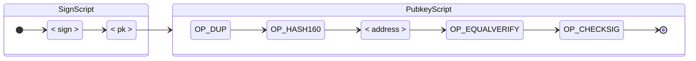

# Bitcoin

## Blockchain

La blockchain è una struttura dati ordinata, immutabile e condivisa che mantiene una traccia di tutte le transazioni effettuate. Questa soluzione, se ben implementata, evita pratiche quali double spending e la modifica di transazioni precedenti.

Ogni full-node Bitcoin possiede una copia personale dell'intera blockchain, validata blocco per blocco. Se più nodi possiedono una copia conforme della stessa blockchain, essi sono in **consenso**. Perché ciò avvenga, devono essere stabilite delle regole comuni, definite **regole di consenso**.

## Blocchi

La blockchain è composta da blocchi a cui sono associate un gruppo di transazioni. In realtà, queste vanno poi a comporre un **Merkle tree**, e solo la **Merkle root** viene salvata nel **block header**, al fine di ridurre al minimo lo spazio utilizzato senza compromettere la sicurezza della struttura. Nel **block header** viene salvato anche l'hash del blocco precedente,  per assicurare che una qualsiasi parte della catena non possa essere modificata senza che ciò invalidi tutti i blocchi successivi.

<div style="text-align: center">
<svg width="480pt" height="220pt" color="black"
 viewBox="0.00 0.00 480.00 220.44" xmlns="http://www.w3.org/2000/svg" xmlns:xlink="http://www.w3.org/1999/xlink">
<g id="graph1" class="graph" transform="scale(0.752351 0.752351) rotate(0) translate(4 289)">
<title>blockchain</title>
<polygon fill="white" stroke="white" points="-4,5 -4,-289 635,-289 635,5 -4,5"/>
<text text-anchor="middle" x="315" y="-8.4" font-family="Sans" font-size="14.00">Simplified Bitcoin Block Chain</text>
<g id="graph2" class="cluster"><title>cluster_block0header</title>
<polygon fill="none" stroke="black" stroke-width="1.75" points="34,-97 34,-277 186,-277 186,-97 34,-97"/>
<text text-anchor="middle" x="110" y="-260.4" font-family="Sans" font-size="14.00">Block 1</text>
<text text-anchor="middle" x="110" y="-243.4" font-family="Sans" font-size="14.00">Header</text>
</g>
<g id="graph3" class="cluster"><title>cluster_block1header</title>
<polygon fill="none" stroke="black" stroke-width="1.75" points="252,-97 252,-277 404,-277 404,-97 252,-97"/>
<text text-anchor="middle" x="328" y="-260.4" font-family="Sans" font-size="14.00">Block 2</text>
<text text-anchor="middle" x="328" y="-243.4" font-family="Sans" font-size="14.00">Header</text>
</g>
<g id="graph4" class="cluster"><title>cluster_block2header</title>
<polygon fill="none" stroke="black" stroke-width="1.75" points="470,-97 470,-277 622,-277 622,-97 470,-97"/>
<text text-anchor="middle" x="546" y="-260.4" font-family="Sans" font-size="14.00">Block 3</text>
<text text-anchor="middle" x="546" y="-243.4" font-family="Sans" font-size="14.00">Header</text>
</g>
<g id="node1" class="node"><title>_transactions0</title>
<polygon fill="none" stroke="black" stroke-width="1.75" points="182,-83 38,-83 38,-41 182,-41 182,-83"/>
<text text-anchor="middle" x="110" y="-66.4" font-family="Sans" font-size="14.00">Block 1</text>
<text text-anchor="middle" x="110" y="-49.4" font-family="Sans" font-size="14.00">Transactions</text>
</g>
<g id="node5" class="node"><title>hashMerkleRoot0</title>
<polygon fill="none" stroke="black" stroke-width="1.75" points="159,-141 61,-141 61,-105 159,-105 159,-141"/>
<text text-anchor="middle" x="110" y="-118.9" font-family="Sans" font-size="14.00">Merkle Root</text>
</g>
<g id="edge14" class="edge"><title>_transactions0&#45;&gt;hashMerkleRoot0</title>
<path fill="none" stroke="black" stroke-width="1.75" d="M110,-83.4453C110,-87.1101 110,-90.7749 110,-94.4397"/>
<polygon fill="black" stroke="black" points="106.5,-94.7677 110,-104.768 113.5,-94.7678 106.5,-94.7677"/>
</g>
<g id="node6" class="node"><title>_transactions1</title>
<polygon fill="none" stroke="black" stroke-width="1.75" points="400,-83 256,-83 256,-41 400,-41 400,-83"/>
<text text-anchor="middle" x="328" y="-66.4" font-family="Sans" font-size="14.00">Block 2</text>
<text text-anchor="middle" x="328" y="-49.4" font-family="Sans" font-size="14.00">Transactions</text>
</g>
<g id="node9" class="node"><title>hashBlock0</title>
<polygon fill="none" stroke="black" stroke-width="1.75" points="395,-205 261,-205 261,-163 395,-163 395,-205"/>
<text text-anchor="middle" x="328" y="-188.4" font-family="Sans" font-size="14.00">Hash Of Previous</text>
<text text-anchor="middle" x="328" y="-171.4" font-family="Sans" font-size="14.00">Block Header</text>
</g>
<g id="edge7" class="edge"><title>_blockHeader0&#45;&gt;hashBlock0</title>
<path fill="none" stroke="black" stroke-width="1.75" d="M110.753,-226.914C116.577,-226.242 155.06,-221.716 186,-216 207.024,-212.116 229.66,-207.304 250.547,-202.602"/>
<polygon fill="black" stroke="black" points="251.35,-206.009 260.326,-200.38 249.799,-199.183 251.35,-206.009"/>
</g>
<g id="node4" class="node"><title>hashBlock9</title>
<polygon fill="none" stroke="black" stroke-width="1.75" points="177,-205 43,-205 43,-163 177,-163 177,-205"/>
<text text-anchor="middle" x="110" y="-188.4" font-family="Sans" font-size="14.00">Hash Of Previous</text>
<text text-anchor="middle" x="110" y="-171.4" font-family="Sans" font-size="14.00">Block Header</text>
</g>
<g id="node10" class="node"><title>hashMerkleRoot1</title>
<polygon fill="none" stroke="black" stroke-width="1.75" points="377,-141 279,-141 279,-105 377,-105 377,-141"/>
<text text-anchor="middle" x="328" y="-118.9" font-family="Sans" font-size="14.00">Merkle Root</text>
</g>
<g id="edge16" class="edge"><title>_transactions1&#45;&gt;hashMerkleRoot1</title>
<path fill="none" stroke="black" stroke-width="1.75" d="M328,-83.4453C328,-87.1101 328,-90.7749 328,-94.4397"/>
<polygon fill="black" stroke="black" points="324.5,-94.7677 328,-104.768 331.5,-94.7678 324.5,-94.7677"/>
</g>
<g id="node11" class="node"><title>_transactions2</title>
<polygon fill="none" stroke="black" stroke-width="1.75" points="618,-83 474,-83 474,-41 618,-41 618,-83"/>
<text text-anchor="middle" x="546" y="-66.4" font-family="Sans" font-size="14.00">Block 3</text>
<text text-anchor="middle" x="546" y="-49.4" font-family="Sans" font-size="14.00">Transactions</text>
</g>
<g id="node15" class="node"><title>hashBlock1</title>
<polygon fill="none" stroke="black" stroke-width="1.75" points="613,-205 479,-205 479,-163 613,-163 613,-205"/>
<text text-anchor="middle" x="546" y="-188.4" font-family="Sans" font-size="14.00">Hash Of Previous</text>
<text text-anchor="middle" x="546" y="-171.4" font-family="Sans" font-size="14.00">Block Header</text>
</g>
<g id="edge9" class="edge"><title>_blockHeader1&#45;&gt;hashBlock1</title>
<path fill="none" stroke="black" stroke-width="1.75" d="M328.753,-226.914C334.577,-226.242 373.06,-221.716 404,-216 425.024,-212.116 447.66,-207.304 468.547,-202.602"/>
<polygon fill="black" stroke="black" points="469.35,-206.009 478.326,-200.38 467.799,-199.183 469.35,-206.009"/>
</g>
<g id="node16" class="node"><title>hashMerkleRoot2</title>
<polygon fill="none" stroke="black" stroke-width="1.75" points="595,-141 497,-141 497,-105 595,-105 595,-141"/>
<text text-anchor="middle" x="546" y="-118.9" font-family="Sans" font-size="14.00">Merkle Root</text>
</g>
<g id="edge18" class="edge"><title>_transactions2&#45;&gt;hashMerkleRoot2</title>
<path fill="none" stroke="black" stroke-width="1.75" d="M546,-83.4453C546,-87.1101 546,-90.7749 546,-94.4397"/>
<polygon fill="black" stroke="black" points="542.5,-94.7677 546,-104.768 549.5,-94.7678 542.5,-94.7677"/>
</g>
<g id="edge5" class="edge"><title>invis0&#45;&gt;hashBlock9</title>
<path fill="none" stroke="black" stroke-width="1.75" stroke-dasharray="1,5" d="M1.69605,-184C4.67071,-184 16.8595,-184 32.0519,-184"/>
<polygon fill="black" stroke="black" points="32.4026,-187.5 42.4025,-184 32.4025,-180.5 32.4026,-187.5"/>
</g>
</g>
</svg>
</div>
### Transazioni in un blocco

Ogni blocco, per essere creato, deve comprendere almeno la **coinbase transaction**. Questa transazione speciale assegna la ricompensa prevista in quel momento al miner, con la condizione straordinaria che l'**UTXO** non potrà essere speso se non fra 100 blocchi, per dare il tempo alla chain di assicurarsi che il blocco sia definitivo.

Sebbene sia sufficiente includere solo questa singola transazione, è nell'interesse dei miner provare a saturare il blocco con altre transazioni, in quanto queste potrebbero includere delle fee addizionali che il miner potrebbe intascarsi, rendendole ancora più appetibili ai suoi occhi.

Tutte le transazioni sono salvate in formato binario, e il valore ottenuto viene poi hashato per ottenere il **TxID**. Tutti i TxIDs, accoppiati a due a due, vengono usati per costruire il **Merkle tree**. Un eventuale TxID dispari viene accoppiato con una copia di se stesso. Il processo si conclude con il calcolo della **Merkle root**. L'utilizzo di un Merkle tree rende anche molto efficiente verificare la presenza di una determinata transazione nel blocco senza doverle scaricare tutte. Ad esempio, per verificare che D è stato aggiunto nel blocco, un nodo light necessita solo delle TxID *C*, *AB*, and *EEEE*, oltre che alla Merkle root, presente nel block header.

```
       ABCDEEEE .......Merkle root
      /        \
   ABCD        EEEE
  /    \      /
 AB    CD    EE .......E is paired with itself
/  \  /  \  /
A  B  C  D  E .........Transactions
```

### Hard e soft forks

Nel momento in cui viene cambiato l'algoritmo di consenso, qualsiasi sia il motivo, si viene a creare una situazione particolare, in cui si possono avere risvolti diversi a seconda del tipo di cambiamento.

- **Hard fork:** un blocco prodotto con il nuovo protollo viene accettato dai nodi aggiornati ma rigettato da quelli vecchi. Si crea una incompatibilità irrisolvibile e si sdoppia la blockchain
- **Soft fork:** un blocco che prodotto con il nuovo protocollo è comunque un blocco valido agli occhi dei nodi vecchi, e viene quindi accettato da tutti. Al contrario, un blocco che segue il vecchio protocollo verrà rigettato dai nodi nuovi. Se i nodi aggiornati sono la maggioranza, la catena proseguirà con il protocollo aggiornato

Per evitare disservizi e mantenere tutti i nodi aggiornati, cambiamenti significativi di questo tipo sono programmati con largo anticipo inserendo una flag all'interno del software che verrà attivata all'unisono al momento stabilito. Si tratta delle **[User Activated Soft Forks](https://developer.bitcoin.org/glossary.html#term-UASF) (UASF).** Un'altra metodologia è attendere che la maggior parte dei miner si dica pronta al passaggio. Ciò dà vita alle **[Miner Activated Soft Forks](https://developer.bitcoin.org/glossary.html#term-MASF) (MASF)**.

### Accorgersi delle fork

Poiché le fork possono essere estremamente dannose per gli utenti Bitcoin, con potenziali perdite economiche, i software hanno dei sistemi per accorgersi se una fork è in atto, allertando il proprietario. Ciò avviene, ad esempio, se un nodo riceve diversi blocchi più aggiornati del proprio che però non riesce a validare, oppure se la transaction number ricevuta inizia a divergere parecchio da quella usata. Un light node può anche rendersi conto del problema interpellando molti full node che iniziano a fornire altezze dei blocchi molto diverse, segno che sono in disaccordo sull'algoritmo di consenso.

## Transazioni

Sebbene si possa avere l'impressione di possedere un account con un bilancio ben stabilito e facilmente consultabile, la verità è che i bitcoin si muovono transazione per transazione. In effetti, ogni bitcoin speso, che diventa l'**output** della transazione, diverrà poi l'**input** di una transazione successiva. Una transazione può creare multipli output, ma uno specifico output può essere usato come input una sola volta in tutta la blockchain. Provare ad utilizzarlo successivamente sarebbe un tentativo di double spending.

Gli output sono identificati da i **[transaction identifiers](https://developer.bitcoin.org/glossary.html#term-Txid) (TxIDs)**. Si tratta degli hash delle transazioni firmate. Gli output delle transazioni in un determinato istante di vita della blockchain posso essere suddivisi in **[Unspent Transaction Outputs (UTXOs)](https://developer.bitcoin.org/glossary.html#term-UTXO)** o **Spent Transaction Outputs**. Dire che un indirizzo ha una certa quantità di bitcoin vuol dire che ci sono quel numero di bitcoin in uno o più UTXOs a suo nome.

Ogni output prodotto da una transazione ha un indice in basa alla sua posizione nel vettore degli output, anche chiamato **vout**. Il valore che contiene potrà essere speso da chiunque sia in grado di soddisfare le condizione specificate del **pubkey script**. 

Per essere usato come input di una transazione successiva, è necessario specificare la TxID e la posizione dell'output che si intende sfruttare. Viene anche specificato uno **signature script** che viene utilizzato, in combinazione con il pubkey script, per validare la transazione, ammesso che soddisfi le condizioni previste.

<div style="text-align: center">
<svg width="450pt" height="189pt" color="black"
 viewBox="0.00 0.00 450.00 189.14" xmlns="http://www.w3.org/2000/svg" xmlns:xlink="http://www.w3.org/1999/xlink">
<g id="graph1" class="graph" transform="scale(0.703125 0.703125) rotate(0) translate(4 265)">
<title>tx_overview</title>
<polygon fill="white" stroke="white" points="-4,5 -4,-265 637,-265 637,5 -4,5"/>
<text text-anchor="middle" x="316" y="-8.4" font-family="Sans" font-size="14.00">Overview Of Transaction Spending</text>
<g id="graph2" class="cluster"><title>cluster_tx0</title>
<polygon fill="none" stroke="black" stroke-width="0" points="185,-154 185,-253 494,-253 494,-154 185,-154"/>
</g>
<g id="graph3" class="cluster"><title>cluster_outputs</title>
<polygon fill="none" stroke="black" stroke-width="1.75" points="193,-162 193,-245 486,-245 486,-162 193,-162"/>
<text text-anchor="middle" x="339.5" y="-228.4" font-family="Sans" font-size="14.00">Example Output Paying A Pubkey Script</text>
</g>
<g id="graph4" class="cluster"><title>cluster_tx1</title>
<polygon fill="none" stroke="black" stroke-width="0" points="104,-33 104,-132 476,-132 476,-33 104,-33"/>
</g>
<g id="graph5" class="cluster"><title>cluster_inputs</title>
<polygon fill="none" stroke="black" stroke-width="1.75" points="112,-41 112,-124 468,-124 468,-41 112,-41"/>
<text text-anchor="middle" x="290" y="-49.4" font-family="Sans" font-size="14.00">Example Input Spending The Example Output</text>
</g>
<g id="node1" class="node"><title>tx1_label</title>
<text text-anchor="middle" x="48" y="-99.4" font-family="Sans" font-size="14.00">Transaction</text>
<text text-anchor="middle" x="48" y="-82.4" font-family="Sans" font-size="14.00">1</text>
</g>
<g id="node2" class="node"><title>tx0_label</title>
<text text-anchor="middle" x="48" y="-195.4" font-family="Sans" font-size="14.00">Transaction</text>
<text text-anchor="middle" x="48" y="-178.4" font-family="Sans" font-size="14.00">0</text>
</g>
<g id="node17" class="node"><title>txid</title>
<polygon fill="none" stroke="black" stroke-width="1.75" points="216,-116 120,-116 120,-74 216,-74 216,-116"/>
<text text-anchor="middle" x="168" y="-99.4" font-family="Sans" font-size="14.00">Transaction</text>
<text text-anchor="middle" x="168" y="-82.4" font-family="Sans" font-size="14.00">Identifier</text>
</g>
<g id="edge14" class="edge"><title>tx0_label&#45;&gt;txid</title>
<path fill="none" stroke="black" stroke-width="1.75" stroke-dasharray="5,2" d="M74.3345,-169.932C91.8413,-155.927 115.002,-137.399 133.912,-122.271"/>
<polygon fill="black" stroke="black" points="136.105,-124.998 141.727,-116.018 131.732,-119.532 136.105,-124.998"/>
</g>
<g id="node4" class="node"><title>tx1_notshown</title>
<text text-anchor="middle" x="564" y="-107.9" font-family="Sans" font-size="14.00">Not Shown:</text>
<text text-anchor="middle" x="564" y="-90.9" font-family="Sans" font-size="14.00">Version, Outputs,</text>
<text text-anchor="middle" x="564" y="-73.9" font-family="Sans" font-size="14.00">Locktime</text>
</g>
<g id="node5" class="node"><title>tx0_notshown</title>
<text text-anchor="middle" x="564" y="-203.9" font-family="Sans" font-size="14.00">Not Shown:</text>
<text text-anchor="middle" x="564" y="-186.9" font-family="Sans" font-size="14.00">Version, Inputs,</text>
<text text-anchor="middle" x="564" y="-169.9" font-family="Sans" font-size="14.00">Locktime</text>
</g>
<g id="node9" class="node"><title>pubkey_script</title>
<polygon fill="none" stroke="black" stroke-width="1.75" points="451,-212 385,-212 385,-170 451,-170 451,-212"/>
<text text-anchor="middle" x="418" y="-195.4" font-family="Sans" font-size="14.00">Pubkey</text>
<text text-anchor="middle" x="418" y="-178.4" font-family="Sans" font-size="14.00">Script</text>
</g>
<g id="node16" class="node"><title>signature_script</title>
<polygon fill="none" stroke="black" stroke-width="1.75" points="460,-116 376,-116 376,-74 460,-74 460,-116"/>
<text text-anchor="middle" x="418" y="-99.4" font-family="Sans" font-size="14.00">Signature</text>
<text text-anchor="middle" x="418" y="-82.4" font-family="Sans" font-size="14.00">Script</text>
</g>
<g id="edge10" class="edge"><title>pubkey_script&#45;&gt;signature_script</title>
<path fill="none" stroke="black" stroke-width="1.75" stroke-dasharray="5,2" d="M418,-169.694C418,-157.017 418,-140.697 418,-126.547"/>
<polygon fill="black" stroke="black" points="421.5,-126.246 418,-116.246 414.5,-126.246 421.5,-126.246"/>
</g>
<g id="node10" class="node"><title>amount</title>
<polygon fill="none" stroke="black" stroke-width="1.75" points="380,-212 298,-212 298,-170 380,-170 380,-212"/>
<text text-anchor="middle" x="339" y="-195.4" font-family="Sans" font-size="14.00">Amount</text>
<text text-anchor="middle" x="339" y="-178.4" font-family="Sans" font-size="14.00">(satoshis)</text>
</g>
<g id="node11" class="node"><title>output0_label</title>
<text text-anchor="middle" x="253" y="-195.4" font-family="Sans" font-size="14.00">Output 0</text>
<text text-anchor="middle" x="253" y="-178.4" font-family="Sans" font-size="14.00">(Implied)</text>
</g>
<g id="node14" class="node"><title>index</title>
<polygon fill="none" stroke="black" stroke-width="1.75" points="286,-116 220,-116 220,-74 286,-74 286,-116"/>
<text text-anchor="middle" x="253" y="-99.4" font-family="Sans" font-size="14.00">Output</text>
<text text-anchor="middle" x="253" y="-82.4" font-family="Sans" font-size="14.00">Index</text>
</g>
<g id="edge12" class="edge"><title>output0_label&#45;&gt;index</title>
<path fill="none" stroke="black" stroke-width="1.75" stroke-dasharray="5,2" d="M253,-169.694C253,-157.017 253,-140.697 253,-126.547"/>
<polygon fill="black" stroke="black" points="256.5,-126.246 253,-116.246 249.5,-126.246 256.5,-126.246"/>
</g>
<g id="node15" class="node"><title>sequence</title>
<polygon fill="none" stroke="black" stroke-width="1.75" points="372,-116 290,-116 290,-74 372,-74 372,-116"/>
<text text-anchor="middle" x="331" y="-99.4" font-family="Sans" font-size="14.00">Sequence</text>
<text text-anchor="middle" x="331" y="-82.4" font-family="Sans" font-size="14.00">Number</text>
</g>
</g>
</svg>
</div>

Per essere valida, una transazione deve contenere come input unicamente **UTXOs**. Inoltre, ovviamente, la somma degli  input deve essere maggiore o uguale alla somma degli output. La differenza fra output e input, necessariamente non negativa, potrà essere reclamata come **transaction fee** dal **miner**. Ad esempio, tutte le transazioni rappresentate in figura stanno pagando 10k satoshi come transaction fee.

<div style="text-align: center">
<svg width="450pt" height="353pt" color="black"
 viewBox="0.00 0.00 450.00 353.37" xmlns="http://www.w3.org/2000/svg" xmlns:xlink="http://www.w3.org/1999/xlink">
<g id="graph1" class="graph" transform="scale(0.690184 0.690184) rotate(0) translate(4 508)">
<title>blockchain</title>
<polygon fill="white" stroke="white" points="-4,5 -4,-508 649,-508 649,5 -4,5"/>
<text text-anchor="middle" x="322" y="-8.4" font-family="Sans" font-size="14.00">Triple&#45;Entry Bookkeeping (Transaction&#45;To&#45;Transaction Payments) As Used By Bitcoin</text>
<g id="graph2" class="cluster"><title>cluster_tx0</title>
<polygon fill="none" stroke="black" points="78,-290 78,-492 188,-492 188,-290 78,-290"/>
<text text-anchor="middle" x="133" y="-475.4" font-family="Sans" font-size="14.00">Transaction 0</text>
<text text-anchor="middle" x="133" y="-458.4" font-family="Sans" font-size="14.00">(TX 0)</text>
</g>
<g id="graph3" class="cluster"><title>cluster_tx1</title>
<polygon fill="none" stroke="black" points="232,-365 232,-496 320,-496 320,-365 232,-365"/>
<text text-anchor="middle" x="276" y="-479.4" font-family="Sans" font-size="14.00">TX 1</text>
</g>
<g id="graph4" class="cluster"><title>cluster_tx2</title>
<polygon fill="none" stroke="black" points="232,-172 232,-357 320,-357 320,-172 232,-172"/>
<text text-anchor="middle" x="276" y="-340.4" font-family="Sans" font-size="14.00">TX 2</text>
</g>
<g id="graph5" class="cluster"><title>cluster_tx3</title>
<polygon fill="none" stroke="black" points="364,-311 364,-442 452,-442 452,-311 364,-311"/>
<text text-anchor="middle" x="408" y="-425.4" font-family="Sans" font-size="14.00">TX 3</text>
</g>
<g id="graph6" class="cluster"><title>cluster_tx4</title>
<polygon fill="none" stroke="black" points="364,-172 364,-303 452,-303 452,-172 364,-172"/>
<text text-anchor="middle" x="408" y="-286.4" font-family="Sans" font-size="14.00">TX 4</text>
</g>
<g id="graph7" class="cluster"><title>cluster_tx5</title>
<polygon fill="none" stroke="black" points="364,-33 364,-164 452,-164 452,-33 364,-33"/>
<text text-anchor="middle" x="408" y="-147.4" font-family="Sans" font-size="14.00">TX 5</text>
</g>
<g id="graph8" class="cluster"><title>cluster_tx6</title>
<polygon fill="none" stroke="black" points="496,-41 496,-226 584,-226 584,-41 496,-41"/>
<text text-anchor="middle" x="540" y="-209.4" font-family="Sans" font-size="14.00">TX 6</text>
</g>
<g id="node2" class="node"><title>tx0_input0</title>
<polygon fill="none" stroke="black" points="164,-442 102,-442 102,-406 164,-406 164,-442"/>
<text text-anchor="middle" x="133" y="-419.9" font-family="Sans" font-size="14.00">input0</text>
</g>
<g id="node3" class="node"><title>tx0_output0</title>
<polygon fill="none" stroke="black" points="169,-388 97,-388 97,-352 169,-352 169,-388"/>
<text text-anchor="middle" x="133" y="-365.9" font-family="Sans" font-size="14.00">output0</text>
</g>
<g id="node6" class="node"><title>tx1_input0</title>
<polygon fill="none" stroke="black" points="307,-463 245,-463 245,-427 307,-427 307,-463"/>
<text text-anchor="middle" x="276" y="-440.9" font-family="Sans" font-size="14.00">input0</text>
</g>
<g id="edge11" class="edge"><title>tx0_output0&#45;&gt;tx1_input0</title>
<path fill="none" stroke="black" d="M169.205,-387.498C175.495,-390.616 181.955,-393.869 188,-397 203.741,-405.152 220.887,-414.416 235.828,-422.616"/>
<polygon fill="black" stroke="black" points="234.367,-425.807 244.814,-427.565 237.744,-419.675 234.367,-425.807"/>
<text text-anchor="middle" x="210" y="-419.4" font-family="Sans" font-size="14.00">40k</text>
</g>
<g id="node4" class="node"><title>tx0_output1</title>
<polygon fill="none" stroke="black" points="169,-334 97,-334 97,-298 169,-298 169,-334"/>
<text text-anchor="middle" x="133" y="-311.9" font-family="Sans" font-size="14.00">output1</text>
</g>
<g id="node9" class="node"><title>tx2_input0</title>
<polygon fill="none" stroke="black" points="307,-324 245,-324 245,-288 307,-288 307,-324"/>
<text text-anchor="middle" x="276" y="-301.9" font-family="Sans" font-size="14.00">input0</text>
</g>
<g id="edge13" class="edge"><title>tx0_output1&#45;&gt;tx2_input0</title>
<path fill="none" stroke="black" d="M169.085,-313.477C189.045,-312.081 213.932,-310.34 234.671,-308.89"/>
<polygon fill="black" stroke="black" points="235.052,-312.372 244.784,-308.183 234.564,-305.389 235.052,-312.372"/>
<text text-anchor="middle" x="210" y="-315.4" font-family="Sans" font-size="14.00">50k</text>
</g>
<g id="node7" class="node"><title>tx1_output0</title>
<polygon fill="none" stroke="black" points="312,-409 240,-409 240,-373 312,-373 312,-409"/>
<text text-anchor="middle" x="276" y="-386.9" font-family="Sans" font-size="14.00">output0</text>
</g>
<g id="node13" class="node"><title>tx3_input0</title>
<polygon fill="none" stroke="black" points="439,-409 377,-409 377,-373 439,-373 439,-409"/>
<text text-anchor="middle" x="408" y="-386.9" font-family="Sans" font-size="14.00">input0</text>
</g>
<g id="edge15" class="edge"><title>tx1_output0&#45;&gt;tx3_input0</title>
<path fill="none" stroke="black" d="M312.07,-391C328.884,-391 348.988,-391 366.437,-391"/>
<polygon fill="black" stroke="black" points="366.906,-394.5 376.906,-391 366.906,-387.5 366.906,-394.5"/>
<text text-anchor="middle" x="342" y="-395.4" font-family="Sans" font-size="14.00">30k</text>
</g>
<g id="node10" class="node"><title>tx2_output0</title>
<polygon fill="none" stroke="black" points="312,-270 240,-270 240,-234 312,-234 312,-270"/>
<text text-anchor="middle" x="276" y="-247.9" font-family="Sans" font-size="14.00">output0</text>
</g>
<g id="node16" class="node"><title>tx4_input0</title>
<polygon fill="none" stroke="black" points="439,-270 377,-270 377,-234 439,-234 439,-270"/>
<text text-anchor="middle" x="408" y="-247.9" font-family="Sans" font-size="14.00">input0</text>
</g>
<g id="edge17" class="edge"><title>tx2_output0&#45;&gt;tx4_input0</title>
<path fill="none" stroke="black" d="M312.07,-252C328.884,-252 348.988,-252 366.437,-252"/>
<polygon fill="black" stroke="black" points="366.906,-255.5 376.906,-252 366.906,-248.5 366.906,-255.5"/>
<text text-anchor="middle" x="342" y="-256.4" font-family="Sans" font-size="14.00">20k</text>
</g>
<g id="node11" class="node"><title>tx2_output1</title>
<polygon fill="none" stroke="black" points="312,-216 240,-216 240,-180 312,-180 312,-216"/>
<text text-anchor="middle" x="276" y="-193.9" font-family="Sans" font-size="14.00">output1</text>
</g>
<g id="node19" class="node"><title>tx5_input0</title>
<polygon fill="none" stroke="black" points="439,-131 377,-131 377,-95 439,-95 439,-131"/>
<text text-anchor="middle" x="408" y="-108.9" font-family="Sans" font-size="14.00">input0</text>
</g>
<g id="edge19" class="edge"><title>tx2_output1&#45;&gt;tx5_input0</title>
<path fill="none" stroke="black" d="M303.994,-179.974C323.682,-167.296 350.215,-150.21 371.554,-136.469"/>
<polygon fill="black" stroke="black" points="373.534,-139.357 380.047,-131 369.744,-133.472 373.534,-139.357"/>
<text text-anchor="middle" x="342" y="-168.4" font-family="Sans" font-size="14.00">20k</text>
</g>
<g id="node14" class="node"><title>tx3_output0</title>
<polygon fill="none" stroke="black" points="444,-355 372,-355 372,-319 444,-319 444,-355"/>
<text text-anchor="middle" x="408" y="-332.9" font-family="Sans" font-size="14.00">output0</text>
</g>
<g id="edge25" class="edge"><title>tx3_output0&#45;&gt;utxo0</title>
<path fill="none" stroke="black" stroke-dasharray="5,2" d="M444.204,-337C498.689,-337 598.917,-337 632.049,-337"/>
<polygon fill="black" stroke="black" points="632.145,-340.5 642.145,-337 632.145,-333.5 632.145,-340.5"/>
<text text-anchor="middle" x="540" y="-358.4" font-family="Sans" font-size="14.00">20k Unspent TX</text>
<text text-anchor="middle" x="540" y="-341.4" font-family="Sans" font-size="14.00">Output (UTXO)</text>
</g>
<g id="node17" class="node"><title>tx4_output0</title>
<polygon fill="none" stroke="black" points="444,-216 372,-216 372,-180 444,-180 444,-216"/>
<text text-anchor="middle" x="408" y="-193.9" font-family="Sans" font-size="14.00">output0</text>
</g>
<g id="node22" class="node"><title>tx6_input0</title>
<polygon fill="none" stroke="black" points="571,-193 509,-193 509,-157 571,-157 571,-193"/>
<text text-anchor="middle" x="540" y="-170.9" font-family="Sans" font-size="14.00">input0</text>
</g>
<g id="edge21" class="edge"><title>tx4_output0&#45;&gt;tx6_input0</title>
<path fill="none" stroke="black" d="M444.163,-186.661C449.439,-185.273 454.833,-183.995 460,-183 472.421,-180.608 486.074,-178.907 498.529,-177.707"/>
<polygon fill="black" stroke="black" points="499.003,-181.179 508.657,-176.814 498.388,-174.206 499.003,-181.179"/>
<text text-anchor="middle" x="474" y="-187.4" font-family="Sans" font-size="14.00">10k</text>
</g>
<g id="node20" class="node"><title>tx5_output0</title>
<polygon fill="none" stroke="black" points="444,-77 372,-77 372,-41 444,-41 444,-77"/>
<text text-anchor="middle" x="408" y="-54.9" font-family="Sans" font-size="14.00">output0</text>
</g>
<g id="node23" class="node"><title>tx6_input1</title>
<polygon fill="none" stroke="black" points="571,-139 509,-139 509,-103 571,-103 571,-139"/>
<text text-anchor="middle" x="540" y="-116.9" font-family="Sans" font-size="14.00">input1</text>
</g>
<g id="edge23" class="edge"><title>tx5_output0&#45;&gt;tx6_input1</title>
<path fill="none" stroke="black" d="M444.07,-75.9418C461.202,-83.9887 481.747,-93.6389 499.422,-101.941"/>
<polygon fill="black" stroke="black" points="498.367,-105.312 508.906,-106.395 501.343,-98.9758 498.367,-105.312"/>
<text text-anchor="middle" x="474" y="-100.4" font-family="Sans" font-size="14.00">10k</text>
</g>
<g id="node24" class="node"><title>tx6_output0</title>
<polygon fill="none" stroke="black" points="576,-85 504,-85 504,-49 576,-49 576,-85"/>
<text text-anchor="middle" x="540" y="-62.9" font-family="Sans" font-size="14.00">output0</text>
</g>
<g id="edge27" class="edge"><title>tx6_output0&#45;&gt;utxo1</title>
<path fill="none" stroke="black" stroke-dasharray="5,2" d="M576.024,-67C595.705,-67 618.71,-67 631.993,-67"/>
<polygon fill="black" stroke="black" points="632.339,-70.5001 642.339,-67 632.339,-63.5001 632.339,-70.5001"/>
<text text-anchor="middle" x="613" y="-88.4" font-family="Sans" font-size="14.00">10k</text>
<text text-anchor="middle" x="613" y="-71.4" font-family="Sans" font-size="14.00">UTXO</text>
</g>
<g id="edge9" class="edge"><title>txold&#45;&gt;tx0_input0</title>
<path fill="none" stroke="black" stroke-dasharray="1,5" d="M1.84293,-424C8.67759,-424 55.6789,-424 91.4816,-424"/>
<polygon fill="black" stroke="black" points="91.7074,-427.5 101.707,-424 91.7074,-420.5 91.7074,-427.5"/>
<text text-anchor="middle" x="40" y="-462.4" font-family="Sans" font-size="14.00">100,000</text>
<text text-anchor="middle" x="40" y="-445.4" font-family="Sans" font-size="14.00">(100k)</text>
<text text-anchor="middle" x="40" y="-428.4" font-family="Sans" font-size="14.00">satoshis</text>
</g>
</g>
</svg>
</div>
## Bitcoin scripts

Bitcoin fornisce un semplice linguaggio basato su una macchina con stack. Non dispone di istruzioni di salto, il che rende impossibile implementare cicli. La limitatezza di questo linguaggio, nemmeno Turing completo, è intenzionale, e serve ad impedire che sia abusato da un agente malevolo. Nella pratica, solo un gruppo ristretto di script viene accettato ed eseguito dai nodi.

### Composizione

Uno script si compone di due parti:

- **locking script (scriptPubkey):** creato dal mittente della transazione, viene inserito negli output della stessa. Per poter spendere l'UTXO è necessario che questa parte dello script si concluda senza errori e con un valore **1** sullo stack
- **unlocking script (scriptSig):** inserito dall'utente che intende spendere l'output. Viene eseguito prima del locking script, e deve fornirgli gli input necessari per terminare correttamente 


<div style="text-align: center">
<svg width="450pt" height="203pt" color="black"
 viewBox="0.00 0.00 450.00 203.41" xmlns="http://www.w3.org/2000/svg" xmlns:xlink="http://www.w3.org/1999/xlink">
<g id="graph0" class="graph" transform="scale(0.625869 0.625869) rotate(0) translate(4 321)">
<title>blockchain</title>
<polygon fill="white" stroke="none" points="-4,4 -4,-321 715,-321 715,4 -4,4"/>
<text text-anchor="middle" x="355.5" y="-7.8" font-family="Sans" font-size="14.00">Some Of The Data Signed By Default</text>
<g id="clust1" class="cluster"><title>cluster_tx1</title>
<polygon fill="none" stroke="black" stroke-width="1.75" points="8,-188 8,-263 370,-263 370,-188 8,-188"/>
<text text-anchor="middle" x="189" y="-247.8" font-family="Sans" font-size="14.00">Transaction 1 (TX 0)</text>
</g>
<g id="clust2" class="cluster"><title>cluster_sig</title>
<polygon fill="none" stroke="black" stroke-width="1.75" points="13,-123 13,-163 674,-163 674,-123 13,-123"/>
<text text-anchor="middle" x="343.5" y="-147.8" font-family="Sans" font-size="14.00"> &#160;&#160;&#160;&#160;&#160;&#160;&#160;&#160;&#160;&#160;Signed Data</text>
</g>
<g id="clust3" class="cluster"><title>cluster_tx2</title>
<polygon fill="none" stroke="black" stroke-width="1.75" points="12,-31 12,-106 665,-106 665,-31 12,-31"/>
<text text-anchor="middle" x="338.5" y="-90.8" font-family="Sans" font-size="14.00">Transaction 2 (TX 1)</text>
</g>
<g id="clust4" class="cluster"><title>cluster_bob</title>
<polygon fill="none" stroke="black" stroke-width="1.75" points="378,-180 378,-309 703,-309 703,-180 378,-180"/>
<text text-anchor="middle" x="540.5" y="-293.8" font-family="Sans" font-size="14.00">Bob&#39;s Computer</text>
</g>
<g id="clust5" class="cluster"><title>cluster_tx2t</title>
<polygon fill="none" stroke="black" stroke-width="1.75" points="490,-188 490,-278 695,-278 695,-188 490,-188"/>
<text text-anchor="middle" x="592.5" y="-262.8" font-family="Sans" font-size="14.00">Transaction 2 (TX 1)</text>
<text text-anchor="middle" x="592.5" y="-247.8" font-family="Sans" font-size="14.00">Template</text>
</g>
<g id="node1" class="node"><title>tx1_txid</title>
<polygon fill="none" stroke="black" stroke-width="1.75" points="70,-232 16,-232 16,-196 70,-196 70,-232"/>
<text text-anchor="middle" x="43" y="-210.3" font-family="Sans" font-size="14.00">TXID</text>
</g>
<g id="node10" class="node"><title>tx2_tx1_txid</title>
<polygon fill="none" stroke="black" stroke-width="1.75" points="74,-75 20,-75 20,-39 74,-39 74,-75"/>
<text text-anchor="middle" x="47" y="-53.3" font-family="Sans" font-size="14.00">TXID</text>
</g>
<g id="edge12" class="edge"><title>tx1_txid&#45;&gt;tx2_tx1_txid</title>
<path fill="none" stroke="black" stroke-width="1.75" d="M43.4589,-195.99C44.1484,-168.926 45.4581,-117.521 46.2769,-85.3816"/>
<polygon fill="black" stroke="black" stroke-width="1.75" points="49.7783,-85.3694 46.5342,-75.2835 42.7805,-85.191 49.7783,-85.3694"/>
</g>
<g id="node2" class="node"><title>tx1_vout</title>
<polygon fill="none" stroke="black" stroke-width="1.75" points="245,-232 77,-232 77,-196 245,-196 245,-232"/>
<text text-anchor="middle" x="161" y="-210.3" font-family="Sans" font-size="14.00">Output Index Number</text>
</g>
<g id="node11" class="node"><title>tx2_tx1_vout</title>
<polygon fill="none" stroke="black" stroke-width="1.75" points="249,-75 81,-75 81,-39 249,-39 249,-75"/>
<text text-anchor="middle" x="165" y="-53.3" font-family="Sans" font-size="14.00">Output Index Number</text>
</g>
<g id="edge13" class="edge"><title>tx1_vout&#45;&gt;tx2_tx1_vout</title>
<path fill="none" stroke="black" stroke-width="1.75" d="M161.459,-195.99C162.148,-168.926 163.458,-117.521 164.277,-85.3816"/>
<polygon fill="black" stroke="black" stroke-width="1.75" points="167.778,-85.3694 164.534,-75.2835 160.781,-85.191 167.778,-85.3694"/>
</g>
<g id="node3" class="node"><title>tx1_script</title>
<polygon fill="none" stroke="black" stroke-width="1.75" points="362.5,-232 251.5,-232 251.5,-196 362.5,-196 362.5,-232"/>
<text text-anchor="middle" x="307" y="-210.3" font-family="Sans" font-size="14.00">Pubkey Script</text>
</g>
<g id="edge1" class="edge"><title>tx1_script&#45;&gt;sig_tx1_script</title>
<path fill="none" stroke="black" stroke-width="1.75" d="M307.444,-195.691C307.86,-178.536 308.464,-153.619 308.783,-140.444"/>
<ellipse fill="black" stroke="black" stroke-width="1.75" cx="308.886" cy="-136.203" rx="4" ry="4"/>
</g>
<g id="node12" class="node"><title>tx2_script</title>
<polygon fill="none" stroke="black" stroke-width="1.75" points="578.5,-75 467.5,-75 467.5,-39 578.5,-39 578.5,-75"/>
<text text-anchor="middle" x="523" y="-53.3" font-family="Sans" font-size="14.00">Pubkey Script</text>
</g>
<g id="node14" class="node"><title>tx2_amount</title>
<polygon fill="none" stroke="black" stroke-width="1.75" points="656.5,-75 585.5,-75 585.5,-39 656.5,-39 656.5,-75"/>
<text text-anchor="middle" x="621" y="-53.3" font-family="Sans" font-size="14.00">Amount</text>
</g>
<g id="node15" class="node"><title>tx2_signature</title>
<polygon fill="none" stroke="black" stroke-width="1.75" points="461,-75 377,-75 377,-39 461,-39 461,-75"/>
<text text-anchor="middle" x="419" y="-53.3" font-family="Sans" font-size="14.00">Signature</text>
</g>
<g id="edge11" class="edge"><title>signature&#45;&gt;tx2_signature</title>
<path fill="none" stroke="black" stroke-width="1.75" d="M419,-130.663C419,-126.152 419,-104.238 419,-85.4733"/>
<polygon fill="black" stroke="black" stroke-width="1.75" points="422.5,-85.2247 419,-75.2248 415.5,-85.2248 422.5,-85.2247"/>
</g>
<g id="node13" class="node"><title>public_key</title>
<polygon fill="none" stroke="black" stroke-width="1.75" points="370.5,-75 255.5,-75 255.5,-39 370.5,-39 370.5,-75"/>
<text text-anchor="middle" x="313" y="-53.3" font-family="Sans" font-size="14.00">Full Public Key</text>
</g>
<g id="node16" class="node"><title>private_key</title>
<polygon fill="none" stroke="black" stroke-width="1.75" points="481.5,-232 386.5,-232 386.5,-196 481.5,-196 481.5,-232"/>
<text text-anchor="middle" x="434" y="-210.3" font-family="Sans" font-size="14.00">Private Key</text>
</g>
<g id="edge6" class="edge"><title>private_key&#45;&gt;signature</title>
<path fill="none" stroke="black" stroke-width="1.75" stroke-dasharray="1,5" d="M430.671,-195.691C427.552,-178.536 423.022,-153.619 420.626,-140.444"/>
<ellipse fill="black" stroke="black" stroke-width="1.75" cx="419.844" cy="-136.139" rx="4.00001" ry="4.00001"/>
</g>
<g id="node17" class="node"><title>tx2t_script</title>
<polygon fill="none" stroke="black" stroke-width="1.75" points="608.5,-232 497.5,-232 497.5,-196 608.5,-196 608.5,-232"/>
<text text-anchor="middle" x="553" y="-210.3" font-family="Sans" font-size="14.00">Pubkey Script</text>
</g>
<g id="edge14" class="edge"><title>tx2t_script&#45;&gt;tx2_script</title>
<path fill="none" stroke="black" stroke-width="1.75" d="M549.559,-195.99C544.387,-168.926 534.565,-117.521 528.423,-85.3816"/>
<polygon fill="black" stroke="black" stroke-width="1.75" points="531.808,-84.4488 526.494,-75.2835 524.933,-85.7627 531.808,-84.4488"/>
</g>
<g id="node18" class="node"><title>tx2t_amount</title>
<polygon fill="none" stroke="black" stroke-width="1.75" points="686.5,-232 615.5,-232 615.5,-196 686.5,-196 686.5,-232"/>
<text text-anchor="middle" x="651" y="-210.3" font-family="Sans" font-size="14.00">Amount</text>
</g>
<g id="edge15" class="edge"><title>tx2t_amount&#45;&gt;tx2_amount</title>
<path fill="none" stroke="black" stroke-width="1.75" d="M647.559,-195.99C642.387,-168.926 632.565,-117.521 626.423,-85.3816"/>
<polygon fill="black" stroke="black" stroke-width="1.75" points="629.808,-84.4488 624.494,-75.2835 622.933,-85.7627 629.808,-84.4488"/>
</g>
</g>
</svg>
</div>


### Pay-To-Public-Key-Hash (P2PKH)

Questo tipo di script è il più utilizzato per mandare un semplice pagamento all'indirizzo desiderato.



Le operazioni vengono eseguite nell'ordine:

- il destinatario produce la firma la transazione e la pusha sullo stack
- il destinatario pusha la sua chiave pubblica sullo stack
- la chiave viene duplicata sullo stack
- viene hashata e diviene un indirizzo bitcoin
- viene verificato che l'indirizzo prodotto da queste operazioni e quello specificato dal mittente corriposndono
- si controlla che la firma sia valida

<div style="text-align: center">
<svg width="450pt" height="329pt" color="black"
 viewBox="0.00 0.00 450.00 328.62" xmlns="http://www.w3.org/2000/svg" xmlns:xlink="http://www.w3.org/1999/xlink">
<g id="graph1" class="graph" transform="scale(0.592105 0.592105) rotate(0) translate(4 551)">
<title>blockchain</title>
<polygon fill="white" stroke="white" points="-4,5 -4,-551 757,-551 757,5 -4,5"/>
<text text-anchor="middle" x="376" y="-8.4" font-family="Sans" font-size="14.00">Evaluation Stack Over Time During Succesful P2PKH Script Validation</text>
<g id="graph2" class="cluster"><title>cluster_alice</title>
<polygon fill="grey" stroke="black" points="8,-462 8,-539 710,-539 710,-462 8,-462"/>
<text text-anchor="middle" x="359" y="-522.4" font-family="Sans" font-size="14.00">Instructions And Data Provided By Alice In Transaction #1&#39;s Pubkey Script</text>
</g>
<g id="graph3" class="cluster"><title>cluster_bob</title>
<polygon fill="grey" stroke="black" points="8,-377 8,-454 710,-454 710,-377 8,-377"/>
<text text-anchor="middle" x="359" y="-437.4" font-family="Sans" font-size="14.00">Data Provided By Bob In Transaction #2&#39;s Input Signature Script</text>
</g>
<g id="node2" class="node"><title>alice_opchecksig</title>
<polygon fill="none" stroke="black" points="702,-506 614,-506 614,-470 702,-470 702,-506"/>
<text text-anchor="middle" x="658" y="-483.9" font-family="Sans" font-size="14.00">CHECKSIG</text>
</g>
<g id="node3" class="node"><title>alice_opequalverify</title>
<polygon fill="none" stroke="black" points="610,-506 468,-506 468,-470 610,-470 610,-506"/>
<text text-anchor="middle" x="539" y="-483.9" font-family="Sans" font-size="14.00">OP_EQUALVERIFY</text>
</g>
<g id="node4" class="node"><title>alice_pubkeyhash</title>
<ellipse fill="none" stroke="black" cx="414" cy="-488" rx="50.2242" ry="18"/>
<text text-anchor="middle" x="414" y="-483.9" font-family="Sans" font-size="14.00">Pk Hash</text>
</g>
<g id="node5" class="node"><title>alice_ophash</title>
<polygon fill="none" stroke="black" points="360,-506 250,-506 250,-470 360,-470 360,-506"/>
<text text-anchor="middle" x="305" y="-483.9" font-family="Sans" font-size="14.00">OP_HASH160</text>
</g>
<g id="node6" class="node"><title>alice_opdup</title>
<polygon fill="none" stroke="black" points="246,-506 172,-506 172,-470 246,-470 246,-506"/>
<text text-anchor="middle" x="209" y="-483.9" font-family="Sans" font-size="14.00">OP_DUP</text>
</g>
<g id="edge40" class="edge"><title>alice_opdup&#45;&gt;invis2_1</title>
<path fill="none" stroke="black" stroke-dasharray="1,5" d="M209.16,-469.647C209.559,-423.956 210.588,-306.178 210.905,-269.84"/>
<polygon fill="black" stroke="black" points="214.406,-269.73 210.994,-259.7 207.407,-269.669 214.406,-269.73"/>
</g>
<g id="node15" class="node"><title>bob_pubkey</title>
<ellipse fill="none" stroke="black" cx="121" cy="-403" rx="46.7546" ry="18"/>
<text text-anchor="middle" x="121" y="-398.9" font-family="Sans" font-size="14.00">PubKey</text>
</g>
<g id="node16" class="node"><title>bob_sig</title>
<ellipse fill="none" stroke="black" cx="43" cy="-403" rx="27" ry="18"/>
<text text-anchor="middle" x="43" y="-398.9" font-family="Sans" font-size="14.00">Sig</text>
</g>
<g id="node45" class="node"><title>stack7_opchecksig</title>
<polygon fill="lightgrey" stroke="black" points="723,-205 607,-205 607,-169 723,-169 723,-205"/>
<text text-anchor="middle" x="665" y="-182.9" font-family="Sans" font-size="14.00">OP_CHECKSIG</text>
</g>
<g id="node48" class="node"><title>stack6_opequalverify</title>
<polygon fill="lightgrey" stroke="black" points="610,-349 468,-349 468,-313 610,-313 610,-349"/>
<text text-anchor="middle" x="539" y="-326.9" font-family="Sans" font-size="14.00">OP_EQUALVERIFY</text>
</g>
<g id="node53" class="node"><title>stack5_pubkeyhash</title>
<ellipse fill="none" stroke="black" cx="420" cy="-259" rx="50.2242" ry="18"/>
<text text-anchor="middle" x="420" y="-254.9" font-family="Sans" font-size="14.00">Pk Hash</text>
</g>
<g id="node57" class="node"><title>stack4_ophash</title>
<polygon fill="lightgrey" stroke="black" points="365,-277 255,-277 255,-241 365,-241 365,-277"/>
<text text-anchor="middle" x="310" y="-254.9" font-family="Sans" font-size="14.00">OP_HASH160</text>
</g>
<g id="node64" class="node"><title>stack2_pubkey</title>
<ellipse fill="none" stroke="black" cx="114" cy="-115" rx="46.7546" ry="18"/>
<text text-anchor="middle" x="114" y="-110.9" font-family="Sans" font-size="14.00">PubKey</text>
</g>
<g id="edge25" class="edge"><title>bob_sig&#45;&gt;invis0_1</title>
<path fill="none" stroke="black" stroke-dasharray="1,5" d="M43.1267,-384.762C43.338,-354.322 43.7563,-294.095 43.9259,-269.668"/>
<polygon fill="black" stroke="black" points="47.4265,-269.584 43.9961,-259.56 40.4267,-269.535 47.4265,-269.584"/>
</g>
<g id="node66" class="node"><title>stack1_sig</title>
<ellipse fill="none" stroke="black" cx="44" cy="-43" rx="27" ry="18"/>
<text text-anchor="middle" x="44" y="-38.9" font-family="Sans" font-size="14.00">Sig</text>
</g>
<g id="node61" class="node"><title>stack3_opdup</title>
<polygon fill="lightgrey" stroke="black" points="249,-205 175,-205 175,-169 249,-169 249,-205"/>
<text text-anchor="middle" x="212" y="-182.9" font-family="Sans" font-size="14.00">OP_DUP</text>
</g>
<g id="node87" class="node"><title>TRUE</title>
<polygon fill="none" stroke="black" points="752,-61 698,-61 698,-25 752,-25 752,-61"/>
<text text-anchor="middle" x="725" y="-38.9" font-family="Sans" font-size="14.00">TRUE</text>
</g>
<g id="node46" class="node"><title>stack7_pubkey</title>
<ellipse fill="lightgrey" stroke="black" cx="665" cy="-115" rx="46.7546" ry="18"/>
<text text-anchor="middle" x="665" y="-110.9" font-family="Sans" font-size="14.00">PubKey</text>
</g>
<g id="edge86" class="edge"><title>stack7_opchecksig&#45;&gt;TRUE</title>
<path fill="none" stroke="black" d="M672.599,-168.762C682.923,-143.985 701.47,-99.4714 713.503,-70.5939"/>
<polygon fill="black" stroke="black" points="716.847,-71.6666 717.463,-61.0896 710.386,-68.9742 716.847,-71.6666"/>
</g>
<g id="edge100" class="edge"><title>stack7_pubkey&#45;&gt;stack7_opchecksig</title>
<path fill="none" stroke="black" d="M666.328,-133.413C666.49,-141.059 666.538,-150.108 666.47,-158.573"/>
<polygon fill="black" stroke="black" points="662.967,-158.782 666.323,-168.831 669.966,-158.883 662.967,-158.782"/>
</g>
<g id="node47" class="node"><title>stack7_sig</title>
<ellipse fill="lightgrey" stroke="black" cx="665" cy="-43" rx="27" ry="18"/>
<text text-anchor="middle" x="665" y="-38.9" font-family="Sans" font-size="14.00">Sig</text>
</g>
<g id="edge102" class="edge"><title>stack7_sig&#45;&gt;stack7_pubkey</title>
<path fill="none" stroke="black" d="M666.328,-61.4133C666.49,-69.0593 666.538,-78.1084 666.47,-86.5726"/>
<polygon fill="black" stroke="black" points="662.967,-86.7821 666.323,-96.8314 669.966,-86.8827 662.967,-86.7821"/>
</g>
<g id="node49" class="node"><title>stack6_pubkeyhash</title>
<ellipse fill="lightgrey" stroke="black" cx="539" cy="-259" rx="50.2242" ry="18"/>
<text text-anchor="middle" x="539" y="-254.9" font-family="Sans" font-size="14.00">Pk Hash</text>
</g>
<g id="edge96" class="edge"><title>stack6_pubkeyhash&#45;&gt;stack6_opequalverify</title>
<path fill="none" stroke="black" d="M540.328,-277.413C540.49,-285.059 540.538,-294.108 540.47,-302.573"/>
<polygon fill="black" stroke="black" points="536.967,-302.782 540.323,-312.831 543.966,-302.883 536.967,-302.782"/>
</g>
<g id="node50" class="node"><title>stack6_ophash</title>
<polygon fill="lightgrey" stroke="black" points="575,-205 503,-205 503,-169 575,-169 575,-205"/>
<text text-anchor="middle" x="539" y="-182.9" font-family="Sans" font-size="14.00">Pk Hash</text>
</g>
<g id="edge98" class="edge"><title>stack6_ophash&#45;&gt;stack6_pubkeyhash</title>
<path fill="none" stroke="black" d="M540.328,-205.413C540.49,-213.059 540.538,-222.108 540.47,-230.573"/>
<polygon fill="black" stroke="black" points="536.967,-230.782 540.323,-240.831 543.966,-230.883 536.967,-230.782"/>
</g>
<g id="node51" class="node"><title>stack6_pubkey</title>
<ellipse fill="none" stroke="black" cx="539" cy="-115" rx="46.7546" ry="18"/>
<text text-anchor="middle" x="539" y="-110.9" font-family="Sans" font-size="14.00">PubKey</text>
</g>
<g id="node52" class="node"><title>stack6_sig</title>
<ellipse fill="none" stroke="black" cx="539" cy="-43" rx="27" ry="18"/>
<text text-anchor="middle" x="539" y="-38.9" font-family="Sans" font-size="14.00">Sig</text>
</g>
<g id="node54" class="node"><title>stack5_ophash</title>
<polygon fill="none" stroke="black" points="456,-205 384,-205 384,-169 456,-169 456,-205"/>
<text text-anchor="middle" x="420" y="-182.9" font-family="Sans" font-size="14.00">Pk Hash</text>
</g>
<g id="node55" class="node"><title>stack5_pubkey</title>
<ellipse fill="none" stroke="black" cx="420" cy="-115" rx="46.7546" ry="18"/>
<text text-anchor="middle" x="420" y="-110.9" font-family="Sans" font-size="14.00">PubKey</text>
</g>
<g id="node56" class="node"><title>stack5_sig</title>
<ellipse fill="none" stroke="black" cx="420" cy="-43" rx="27" ry="18"/>
<text text-anchor="middle" x="420" y="-38.9" font-family="Sans" font-size="14.00">Sig</text>
</g>
<g id="edge92" class="edge"><title>stack4_ophash&#45;&gt;stack5_ophash</title>
<path fill="none" stroke="black" d="M337.758,-240.831C351.697,-231.707 368.76,-220.539 383.723,-210.745"/>
<polygon fill="black" stroke="black" points="385.801,-213.568 392.251,-205.163 381.967,-207.711 385.801,-213.568"/>
</g>
<g id="node58" class="node"><title>stack4_opdup</title>
<polygon fill="lightgrey" stroke="black" points="344,-205 276,-205 276,-169 344,-169 344,-205"/>
<text text-anchor="middle" x="310" y="-182.9" font-family="Sans" font-size="14.00">PubKey</text>
</g>
<g id="edge94" class="edge"><title>stack4_opdup&#45;&gt;stack4_ophash</title>
<path fill="none" stroke="black" d="M311.328,-205.413C311.49,-213.059 311.538,-222.108 311.47,-230.573"/>
<polygon fill="black" stroke="black" points="307.967,-230.782 311.323,-240.831 314.966,-230.883 307.967,-230.782"/>
</g>
<g id="node59" class="node"><title>stack4_pubkey</title>
<ellipse fill="none" stroke="black" cx="310" cy="-115" rx="46.7546" ry="18"/>
<text text-anchor="middle" x="310" y="-110.9" font-family="Sans" font-size="14.00">PubKey</text>
</g>
<g id="node60" class="node"><title>stack4_sig</title>
<ellipse fill="none" stroke="black" cx="310" cy="-43" rx="27" ry="18"/>
<text text-anchor="middle" x="310" y="-38.9" font-family="Sans" font-size="14.00">Sig</text>
</g>
<g id="edge88" class="edge"><title>stack3_opdup&#45;&gt;stack4_opdup</title>
<path fill="none" stroke="black" d="M249.133,-187C254.542,-187 259.951,-187 265.36,-187"/>
<polygon fill="black" stroke="black" points="265.762,-190.5 275.762,-187 265.762,-183.5 265.762,-190.5"/>
</g>
<g id="node62" class="node"><title>stack3_pubkey</title>
<ellipse fill="lightgrey" stroke="black" cx="212" cy="-115" rx="46.7546" ry="18"/>
<text text-anchor="middle" x="212" y="-110.9" font-family="Sans" font-size="14.00">PubKey</text>
</g>
<g id="edge90" class="edge"><title>stack3_pubkey&#45;&gt;stack3_opdup</title>
<path fill="none" stroke="black" d="M213.328,-133.413C213.49,-141.059 213.538,-150.108 213.47,-158.573"/>
<polygon fill="black" stroke="black" points="209.967,-158.782 213.323,-168.831 216.966,-158.883 209.967,-158.782"/>
</g>
<g id="node63" class="node"><title>stack3_sig</title>
<ellipse fill="none" stroke="black" cx="212" cy="-43" rx="27" ry="18"/>
<text text-anchor="middle" x="212" y="-38.9" font-family="Sans" font-size="14.00">Sig</text>
</g>
<g id="node65" class="node"><title>stack2_sig</title>
<ellipse fill="none" stroke="black" cx="114" cy="-43" rx="27" ry="18"/>
<text text-anchor="middle" x="114" y="-38.9" font-family="Sans" font-size="14.00">Sig</text>
</g>
</g>
</svg>
</div>

### Pay To Script Hash (P2SH)

P2SH è usato per eseguire uno script arbitrario. Qualsiasi script valido può essere passato come input nel sign script, e, una volta verificata la sua correttezza nel pubkey script, verrà eseguito al suo posto.

Alcuni script utilizzati in questo ambito sono script che scrivono testo sulla blockchain, fino a 1.5 kb, oppure multisignature scripts.

### Multisig

Sebbene ora come ora sia comune utilizzare P2SH per svolgere questa funzione, anche gli script base supportano il multisign. In questo tipo di script, chiamati m-of-n, *m* è il numero minimo di firme valide necessarie, fornite *n* public keys.

A causa di un bug nell'implementazione, mantenuto per retro compatibilità, OP_CHECKMULTISIG consuma un input in più del necessario, cosa che va compensata ogni volta aggiungendo un valore OP_0 in aggiuntivo.

```yaml
Pubkey script: <m> <A pubkey> [B pubkey] [C pubkey...] <n> OP_CHECKMULTISIG
Signature script: OP_0 <A sig> [B sig] [C sig...]
```

Lo stesso obiettivo può essere raggiunto con un P2SH di questo tipo:

```yaml
Pubkey script: OP_HASH160 <Hash160(redeemScript)> OP_EQUAL
Redeem script: <OP_2> <A pubkey> <B pubkey> <C pubkey> <OP_3> OP_CHECKMULTISIG
Signature script: OP_0 <A sig> <C sig> <redeemScript>
```

### Script a tempo

Uno script può anche specificare un tempo di blocco, per cui la transazione viene validata solo se il timestamp o l'altezza del blocco sono state superate. Fino a quando non diviene spendibile, il mittente ha la possibilità di ri-approriarsi dell'output, e dato che il double spending non è consentito, di fatto annulla la transazione.

## Proof of work

Poiché la blockchain è pubblica e potenzialmente vulnerabile ad un qualsiasi agente che voglia minarne la sicurezza e validità, è stato necessario introdurre un sistema che assicuri che un agente malevolo si trovi a dover svolgere un lavoro fin troppo oneroso per riuscire a raggiungere il suo obiettivo. Poiché la modifica di un singolo blocco richiede la modifica in cascata di tutti i successivi, questa operazione diventa sempre più dispendiosa man mano che la catena si allunga.

La proof of work usata da Bitcoin sfrutta la natura apparentemente randomica delle funzioni hash crittografiche. Per fare in modo che il nuovo blocco proposto da un nodo sia accettato come valido da tutti gli altri, l'hash del block header deve essere inferiore, come valore numerico, ad una soglia stabilita, che sancisce anche la difficoltà del puzzle. Questa soglia viene infatti aggiustata periodicamente al fine di garantire una tempistica prestabilita di produzione di nuovi blocchi, circa 10 minuti.
Più precisamente, basandosi sui timestamp salvati nei blocchi, ogni 2016 blocchi aggiunti si controlla che l'intervallo fra il primo e l'ultimo sia di circa 1,209,600 seconds (due settimane). Se questo vincolo non è rispettato, la difficoltà è aumentata o diminuita in proporzione allo squilibrio (fino al 300% o fino al 75%).

### Block height e forking

Ogni volta che una proof of work viene superata con successo, il miner acquisisce il diritto di pubblicare il nuovo blocco e appenderlo alla chain. I blocchi sono spesso indicati facendo riferimento alla loro altezza dal primo blocco, detto anche **genesis block**.

Poiché il minin è un processo asincrono, è comune che più di un blocco venga aggiunto alla blockchain nello stesso slot. Questo genera una **fork**. Tuttavia, seguendo la regola che solo la catena più lunga viene portata avanti, queste temporanee deviazioni vengono presto riassorbite ed eliminate quando una delle catene diventa molto più lunga delle altre. Proprio per questo motivo è bene attendere un numero sufficiente di blocchi prima di essere sicuri che una transazione sia stata effettuata e sia ormai salvata permanentemente nella blockchain.

<div style="text-align: center;">
<svg width="480pt" height="168pt" color="black"
 viewBox="0.00 0.00 480.00 168.40" xmlns="http://www.w3.org/2000/svg" xmlns:xlink="http://www.w3.org/1999/xlink" >
<g id="graph1" class="graph" transform="scale(0.572792 0.572792) rotate(0) translate(4 290)">
<title>blockchain</title>
<polygon fill="white" stroke="white" points="-4,5 -4,-290 835,-290 835,5 -4,5"/>
<g id="graph2" class="cluster"><title>cluster_extended</title>
<polygon fill="none" stroke="black" points="8,-8 8,-139 822,-139 822,-8 8,-8"/>
<text text-anchor="middle" x="415" y="-122.4" font-family="Sans" font-size="14.00">Rare Extended Forking</text>
</g>
<g id="graph3" class="cluster"><title>cluster_normal</title>
<polygon fill="none" stroke="black" points="8,-147 8,-278 822,-278 822,-147 8,-147"/>
<text text-anchor="middle" x="415" y="-261.4" font-family="Sans" font-size="14.00">Normal Occasional Forking</text>
</g>
<g id="node2" class="node"><title>block00</title>
<ellipse fill="none" stroke="black" cx="59" cy="-61" rx="41.8891" ry="18"/>
<text text-anchor="middle" x="59" y="-56.9" font-family="Sans" font-size="14.00">block0</text>
</g>
<g id="node3" class="node"><title>block01</title>
<ellipse fill="none" stroke="black" cx="251" cy="-61" rx="41.8891" ry="18"/>
<text text-anchor="middle" x="251" y="-56.9" font-family="Sans" font-size="14.00">block1</text>
</g>
<g id="edge11" class="edge"><title>block00&#45;&gt;block01</title>
<path fill="none" stroke="black" d="M101.611,-61C130.098,-61 167.781,-61 198.173,-61"/>
<polygon fill="black" stroke="black" points="198.177,-64.5001 208.177,-61 198.177,-57.5001 198.177,-64.5001"/>
<text text-anchor="middle" x="155" y="-65.4" font-family="Sans" font-size="14.00">Header Hash</text>
</g>
<g id="node4" class="node"><title>block02</title>
<ellipse fill="none" stroke="black" cx="355" cy="-34" rx="41.8891" ry="18"/>
<text text-anchor="middle" x="355" y="-29.9" font-family="Sans" font-size="14.00">block2</text>
</g>
<g id="edge13" class="edge"><title>block01&#45;&gt;block02</title>
<path fill="none" stroke="black" d="M287.374,-51.5567C294.143,-49.7993 301.302,-47.9409 308.329,-46.1165"/>
<polygon fill="black" stroke="black" points="309.671,-49.3842 318.471,-43.4836 307.912,-42.6088 309.671,-49.3842"/>
</g>
<g id="node9" class="node"><title>block02x</title>
<ellipse fill="none" stroke="black" cx="355" cy="-88" rx="41.8891" ry="18"/>
<text text-anchor="middle" x="355" y="-83.9" font-family="Sans" font-size="14.00">block2</text>
</g>
<g id="edge3" class="edge"><title>block01&#45;&gt;block02x</title>
<path fill="none" stroke="black" d="M287.374,-70.4433C294.143,-72.2007 301.302,-74.0591 308.329,-75.8835"/>
<polygon fill="black" stroke="black" points="307.912,-79.3912 318.471,-78.5164 309.671,-72.6158 307.912,-79.3912"/>
</g>
<g id="node5" class="node"><title>block03</title>
<ellipse fill="none" stroke="black" cx="459" cy="-34" rx="41.8891" ry="18"/>
<text text-anchor="middle" x="459" y="-29.9" font-family="Sans" font-size="14.00">block3</text>
</g>
<g id="edge15" class="edge"><title>block02&#45;&gt;block03</title>
<path fill="none" stroke="black" d="M397.601,-34C400.397,-34 403.23,-34 406.068,-34"/>
<polygon fill="black" stroke="black" points="406.297,-37.5001 416.297,-34 406.297,-30.5001 406.297,-37.5001"/>
</g>
<g id="node6" class="node"><title>block04</title>
<ellipse fill="none" stroke="black" cx="563" cy="-34" rx="41.8891" ry="18"/>
<text text-anchor="middle" x="563" y="-29.9" font-family="Sans" font-size="14.00">block4</text>
</g>
<g id="edge17" class="edge"><title>block03&#45;&gt;block04</title>
<path fill="none" stroke="black" d="M501.601,-34C504.397,-34 507.23,-34 510.068,-34"/>
<polygon fill="black" stroke="black" points="510.297,-37.5001 520.297,-34 510.297,-30.5001 510.297,-37.5001"/>
</g>
<g id="node7" class="node"><title>block05</title>
<ellipse fill="none" stroke="black" cx="667" cy="-34" rx="41.8891" ry="18"/>
<text text-anchor="middle" x="667" y="-29.9" font-family="Sans" font-size="14.00">block5</text>
</g>
<g id="edge19" class="edge"><title>block04&#45;&gt;block05</title>
<path fill="none" stroke="black" d="M605.601,-34C608.397,-34 611.23,-34 614.068,-34"/>
<polygon fill="black" stroke="black" points="614.297,-37.5001 624.297,-34 614.297,-30.5001 614.297,-37.5001"/>
</g>
<g id="node8" class="node"><title>block06</title>
<ellipse fill="none" stroke="black" cx="771" cy="-34" rx="41.8891" ry="18"/>
<text text-anchor="middle" x="771" y="-29.9" font-family="Sans" font-size="14.00">block6</text>
</g>
<g id="edge21" class="edge"><title>block05&#45;&gt;block06</title>
<path fill="none" stroke="black" d="M709.601,-34C712.397,-34 715.23,-34 718.068,-34"/>
<polygon fill="black" stroke="black" points="718.297,-37.5001 728.297,-34 718.297,-30.5001 718.297,-37.5001"/>
</g>
<g id="node10" class="node"><title>block03x</title>
<ellipse fill="none" stroke="black" cx="459" cy="-88" rx="41.8891" ry="18"/>
<text text-anchor="middle" x="459" y="-83.9" font-family="Sans" font-size="14.00">block3</text>
</g>
<g id="edge5" class="edge"><title>block02x&#45;&gt;block03x</title>
<path fill="none" stroke="black" d="M397.601,-88C400.397,-88 403.23,-88 406.068,-88"/>
<polygon fill="black" stroke="black" points="406.297,-91.5001 416.297,-88 406.297,-84.5001 406.297,-91.5001"/>
</g>
<g id="node11" class="node"><title>block04x</title>
<ellipse fill="none" stroke="black" cx="563" cy="-88" rx="41.8891" ry="18"/>
<text text-anchor="middle" x="563" y="-83.9" font-family="Sans" font-size="14.00">block4</text>
</g>
<g id="edge7" class="edge"><title>block03x&#45;&gt;block04x</title>
<path fill="none" stroke="black" d="M501.601,-88C504.397,-88 507.23,-88 510.068,-88"/>
<polygon fill="black" stroke="black" points="510.297,-91.5001 520.297,-88 510.297,-84.5001 510.297,-91.5001"/>
</g>
<g id="node12" class="node"><title>block05x</title>
<ellipse fill="none" stroke="black" cx="667" cy="-88" rx="41.8891" ry="18"/>
<text text-anchor="middle" x="667" y="-83.9" font-family="Sans" font-size="14.00">block5</text>
</g>
<g id="edge9" class="edge"><title>block04x&#45;&gt;block05x</title>
<path fill="none" stroke="black" d="M605.601,-88C608.397,-88 611.23,-88 614.068,-88"/>
<polygon fill="black" stroke="black" points="614.297,-91.5001 624.297,-88 614.297,-84.5001 614.297,-91.5001"/>
</g>
<g id="node24" class="node"><title>block2x</title>
<ellipse fill="none" stroke="black" cx="355" cy="-173" rx="41.8891" ry="18"/>
<text text-anchor="middle" x="355" y="-168.9" font-family="Sans" font-size="14.00">block2</text>
</g>
<g id="node25" class="node"><title>block5x</title>
<ellipse fill="none" stroke="black" cx="667" cy="-173" rx="41.8891" ry="18"/>
<text text-anchor="middle" x="667" y="-168.9" font-family="Sans" font-size="14.00">block5</text>
</g>
<g id="node26" class="node"><title>block1</title>
<ellipse fill="none" stroke="black" cx="251" cy="-227" rx="41.8891" ry="18"/>
<text text-anchor="middle" x="251" y="-222.9" font-family="Sans" font-size="14.00">block1</text>
</g>
<g id="edge24" class="edge"><title>block1&#45;&gt;block2x</title>
<path fill="none" stroke="black" d="M278.053,-212.953C290.572,-206.453 305.618,-198.641 319.073,-191.655"/>
<polygon fill="black" stroke="black" points="320.82,-194.691 328.082,-186.977 317.594,-188.479 320.82,-194.691"/>
</g>
<g id="node33" class="node"><title>block2</title>
<ellipse fill="none" stroke="black" cx="355" cy="-227" rx="41.8891" ry="18"/>
<text text-anchor="middle" x="355" y="-222.9" font-family="Sans" font-size="14.00">block2</text>
</g>
<g id="edge30" class="edge"><title>block1&#45;&gt;block2</title>
<path fill="none" stroke="black" d="M293.601,-227C296.397,-227 299.23,-227 302.068,-227"/>
<polygon fill="black" stroke="black" points="302.297,-230.5 312.297,-227 302.297,-223.5 302.297,-230.5"/>
</g>
<g id="node28" class="node"><title>block4</title>
<ellipse fill="none" stroke="black" cx="563" cy="-227" rx="41.8891" ry="18"/>
<text text-anchor="middle" x="563" y="-222.9" font-family="Sans" font-size="14.00">block4</text>
</g>
<g id="edge26" class="edge"><title>block4&#45;&gt;block5x</title>
<path fill="none" stroke="black" d="M590.053,-212.953C602.572,-206.453 617.618,-198.641 631.073,-191.655"/>
<polygon fill="black" stroke="black" points="632.82,-194.691 640.082,-186.977 629.594,-188.479 632.82,-194.691"/>
</g>
<g id="node38" class="node"><title>block5</title>
<ellipse fill="none" stroke="black" cx="667" cy="-227" rx="41.8891" ry="18"/>
<text text-anchor="middle" x="667" y="-222.9" font-family="Sans" font-size="14.00">block5</text>
</g>
<g id="edge36" class="edge"><title>block4&#45;&gt;block5</title>
<path fill="none" stroke="black" d="M605.601,-227C608.397,-227 611.23,-227 614.068,-227"/>
<polygon fill="black" stroke="black" points="614.297,-230.5 624.297,-227 614.297,-223.5 614.297,-230.5"/>
</g>
<g id="node30" class="node"><title>block0</title>
<ellipse fill="none" stroke="black" cx="59" cy="-227" rx="41.8891" ry="18"/>
<text text-anchor="middle" x="59" y="-222.9" font-family="Sans" font-size="14.00">block0</text>
</g>
<g id="edge28" class="edge"><title>block0&#45;&gt;block1</title>
<path fill="none" stroke="black" d="M101.611,-227C130.098,-227 167.781,-227 198.173,-227"/>
<polygon fill="black" stroke="black" points="198.177,-230.5 208.177,-227 198.177,-223.5 198.177,-230.5"/>
<text text-anchor="middle" x="155" y="-231.4" font-family="Sans" font-size="14.00">Header Hash</text>
</g>
<g id="node35" class="node"><title>block3</title>
<ellipse fill="none" stroke="black" cx="459" cy="-227" rx="41.8891" ry="18"/>
<text text-anchor="middle" x="459" y="-222.9" font-family="Sans" font-size="14.00">block3</text>
</g>
<g id="edge32" class="edge"><title>block2&#45;&gt;block3</title>
<path fill="none" stroke="black" d="M397.601,-227C400.397,-227 403.23,-227 406.068,-227"/>
<polygon fill="black" stroke="black" points="406.297,-230.5 416.297,-227 406.297,-223.5 406.297,-230.5"/>
</g>
<g id="edge34" class="edge"><title>block3&#45;&gt;block4</title>
<path fill="none" stroke="black" d="M501.601,-227C504.397,-227 507.23,-227 510.068,-227"/>
<polygon fill="black" stroke="black" points="510.297,-230.5 520.297,-227 510.297,-223.5 510.297,-230.5"/>
</g>
<g id="node40" class="node"><title>block6</title>
<ellipse fill="none" stroke="black" cx="771" cy="-227" rx="41.8891" ry="18"/>
<text text-anchor="middle" x="771" y="-222.9" font-family="Sans" font-size="14.00">block6</text>
</g>
<g id="edge38" class="edge"><title>block5&#45;&gt;block6</title>
<path fill="none" stroke="black" d="M709.601,-227C712.397,-227 715.23,-227 718.068,-227"/>
<polygon fill="black" stroke="black" points="718.297,-230.5 728.297,-227 718.297,-223.5 718.297,-230.5"/>
</g>
</g>
</svg>
</div>


